# ADR-0036: Additional Damage and Selective Critical Hits

Date: 2026-01-20

## Status

Proposed

Companion to [ADR-0026: Damage Application via Event Chain](0026-damage-application-via-event-chain.md).

## Context

Monster attacks in D&D 5e frequently deal more than one type of damage on a
single hit — a weapon's physical damage plus an elemental or magical rider. The
canonical example is the ooze's pseudopod: **bludgeoning + acid**.

The toolkit does not model this today. An attack carries exactly one damage
pool: `weapons.Weapon` has a single `Damage` dice string and a single
`DamageType`. Bonus damage of other types can only enter as `DamageComponent`s
added by *conditions* on the damage chain (sneak attack, rage, etc.) — there is
no way to say "this attack *intrinsically* deals slashing + fire."

The second half of the problem is the critical hit. Today, crit doubling is
**pool-level, not component-level**: `ApplyAttackOutcome` calls
`rollDamageDice(pool, roller, 2)` on the weapon's one pool. There is no
per-component notion of "this pool doubles on a crit, that one does not." The
`IsCritical` flag exists on `DamageComponent` but is *set* by whoever adds the
component; nothing *consults* it during doubling.

For the ooze we want the rule many tables play (and the DMG optional rule):
**the physical/weapon dice double on a crit, the rider does not.** RAW 5e
doubles all damage dice; this ADR deliberately adopts the variant, because it is
the behavior the game wants and it keeps the common "weapon + elemental rider"
monster pattern cheap to express.

### Where the pieces live today

```
dice/                      dice.Pool, dice.ParseNotation("1d8" -> Pool), dice.Roller
events/                    EventBus, StagedChain
core/                      Ref, Entity
rulebooks/dnd5e/
  damage/                  Type (bludgeoning, acid, ...) - IsPhysical/IsElemental
  weapons/                 Weapon{Damage string, DamageType, Properties[]WeaponProperty}
  events/                  DamageComponent{FinalDiceRolls, FlatBonus, DamageType,
                                    IsCritical, Multiplier}  <- RICH carrier (attacks)
                            DamageChainEvent, AttackChainEvent, DamageReceivedEvent
  combat/                  AttackInput, AttackContext, ResolveAttackHit, ApplyAttackOutcome
                            ResolveDamage, DealDamage, DealDamageInput
                            DamageInstanceInput{Amount int, Type}  <- SIMPLE carrier (spells/cond)
                            calculateFinalDamage, stages (Base/Features/Conditions/Equipment/Final)
  monster/                 MonsterAction, MeleeConfig{DamageDice, DamageType} -> publishes AttackEvent
encounter/  (SDK)           AttackInput{AttackerDamageDice, AttackerDamageType, Attacker, Defender},
                            CombatResolver.ResolveAttack, DamageDealtEvent
```

### The attack damage flow

```mermaid
flowchart TD
    subgraph P1["phase 1 - ResolveAttackHit (attack_phases.go)"]
        direction LR
        AI["AttackInput<br/>Weapon (1d8 bludgeoning),<br/>Roller, EventBus, IDs<br/>v1: AdditionalDamage []DamageComponentSpec"]
        R1["roll d20 -> AttackRoll"]
        AC["AttackChain: advantage,<br/>pack tactics, crit threshold"]
        CTX["AttackContext{AttackRoll, AbilityMod,<br/>CriticalThreshold, Weapon, IsMelee}<br/>v1: + AdditionalDamage"]
        AI --> R1 --> AC --> CTX
    end

    WIN["reaction window - Shield, Protection"]

    subgraph P2["phase 2 - ApplyAttackOutcome (attack_phases.go)"]
        direction LR
        HIT["hit? crit? vs effectiveAC"]
        ROLL["parse Weapon.Damage -> Pool<br/>roll crit?2:1 -> weaponComponent"]
        ABIL["abilityComponent<br/>FlatBonus=AbilityMod, never doubled"]
        ADD["v1: each AdditionalDamage spec<br/>roll ONCE -> DamageComponent<br/>{Type, IsCritical=false}"]
        HIT --> ROLL --> ABIL --> ADD
    end

    subgraph CH["ResolveDamage - the chain (combat/damage.go)"]
        direction LR
        CE["DamageChainEvent{Components:<br/>weapon, ability, additional}"]
        ST["staged chain Base->Features-><br/>Conditions->Equipment->Final<br/>rage, sneak attack, GWF reroll,<br/>resist x0.5, vuln x2, immune x0"]
        CALC["calculateFinalDamage: group by Type,<br/>apply multipliers -><br/>[]DamageInstanceInput{int}  dice->INTS"]
        TOTAL["TotalDamage + FinalComponents"]
        CE --> ST --> CALC --> TOTAL
    end

    subgraph OUT["returns + notifies"]
        direction LR
        AR["AttackResult{TotalDamage, Critical,<br/>Breakdown.Components}"]
        DRE["publish DamageReceivedEvent"]
        AR --> DRE
    end

    subgraph DOWN["DOWNSTREAM - rpg-api / encounter SDK"]
        direction LR
        HP["Target.ApplyDamage -> HP mutation"]
        DDE["encounter DamageDealtEvent{Components}"]
        HP --> DDE
    end

    CTX --> WIN
    WIN --> HIT
    ADD --> CE
    TOTAL --> AR
    DRE --> HP
```



Three observations that drove this decision:

1. **Dice strings only live at the very top.** `Weapon.Damage` is `"1d8"`;
   `dice.ParseNotation` turns it into a `dice.Pool`, which `ApplyAttackOutcome`
   rolls into `[]int` stored in `DamageComponent.FinalDiceRolls`. The chain keeps
   dice rolls around (for rerolls like GWF and for the combat log). Only
   `calculateFinalDamage` sums them into `DamageInstanceInput.Amount int`. So
   "damage is already an int" is true at the *spells/conditions* entry
   (`DealDamage.Instances`) — **not** at the attack entry. Attacks carry dice
   rolls as `DamageComponent` until the last step. Additional damage is
   dice-based, so it must produce `DamageComponent`s and plug into the attack
   path, not the int path.

2. **Two carriers, one chain.** `DamageInstanceInput{Amount int}` is the simple
   path (spells, conditions, environment — the total is already known).
   `DamageComponent{FinalDiceRolls, FlatBonus, …}` is the rich path (attacks —
   dice are involved). Both converge on `ResolveDamage`. The existing chain and
   `calculateFinalDamage` already group components by damage type and apply
   per-type multipliers, so a second intrinsic damage type needs no new
   resistance/vulnerability machinery — acid resistance will still halve the
   acid component for free.

3. **Crit doubling is the one spot that is pool-level.** Everything downstream
   of `ApplyAttackOutcome` is already component-aware; the only change needed
   for selective crit is in `ApplyAttackOutcome` itself, where additional
   components are rolled once regardless of crit.

## Decision

Add an optional `AdditionalDamage []DamageComponentSpec` to the attack path.
The weapon's own pool remains the primary damage and keeps its existing crit
semantics (rolled twice on a crit). Each additional damage spec is rolled
**once** and is **never doubled on a critical hit**. All components — weapon,
ability, and additional — feed `ResolveDamage` exactly as today.

### v1 type (in `rulebooks/dnd5e/combat/`, next to `AttackInput`)

```go
// DamageComponentSpec is one intrinsic rider damage pool an attack deals on
// a hit. It is rolled once and never doubled on a critical hit.
type DamageComponentSpec struct {
    Dice string      // "1d6"
    Type damage.Type // damage.Acid
}
```

### Threading

- `AttackInput.AdditionalDamage []DamageComponentSpec` (nil/empty = today's
  behavior; every existing test stays green).
- `ResolveAttackHit` copies it onto `AttackContext`.
- `ApplyAttackOutcome`, after building the weapon and ability components, for
  each spec: `dice.ParseNotation(spec.Dice)` → roll once → emit a
  `DamageComponent{Source: …, DamageType: spec.Type, IsCritical: false, …}`.

No change to `ResolveDamage`, the damage chain, or `calculateFinalDamage` —
resistance/vulnerability/immunity already operate per damage type.

### The ooze, expressed

Pseudopod = weapon pool `1d8 bludgeoning` (crit-eligible, as today) +
`AdditionalDamage: [{Dice: "1d6", Type: damage.Acid}]` (never crits). On a crit:
2× bludgeoning dice, 1× acid dice. On a normal hit: 1× each.

### Primary damage pool

The weapon's own pool stays **implicitly crit-eligible** (backwards compatible).
Additional damage is the only place the "never crits" rule applies; making every
pool — including the primary — go through the spec list from day one would be a
larger blast radius across the weapons catalog for no v1 benefit.

## Consequences

### Positive
- Solves the ooze and the large majority of "weapon + elemental/magical rider"
  monster stat blocks in one small, backwards-compatible change.
- The change is localized to `ApplyAttackOutcome` and one new type; the damage
  chain and resistance/vulnerability logic are untouched (already correct).
- Fully testable inside `rpg-toolkit` at the combat layer, independent of
  rpg-api plumbing.

### Negative
- Does not cover the rare case where additional damage *should* crit (e.g. a
  flametongue's fire under strict RAW). Sneak attack is unaffected — it is
  already a condition on the damage chain, not intrinsic attack damage.
- "Additional never crits" is a variant rule, not RAW, adopted deliberately.
- End-to-end exercise for a real monster in a live encounter requires follow-on
  rpg-api resolver plumbing to populate `AttackInput.AdditionalDamage` from a
  monster action. The crit behavior itself is proven at the combat layer first.

### Neutral
- `MeleeConfig`/`BiteConfig`/`RangedConfig` gaining an `AdditionalDamage` field,
  and a `NewOoze()` monster definition, are natural follow-on steps once the
  combat-core behavior is solid. They are authoring convenience, not part of the
  crit decision.
- No change to the lower toolkit layers. A generic "damage builder" in
  `tools/` or `mechanics/` is explicitly deferred until a second rulebook or a
  second consumer makes the unknowns concrete.

## Example

### Test shape (TDD — tests written first, implementation follows)

In `rulebooks/dnd5e/combat/`, driven through `ApplyAttackOutcome` with a rigged
`mockRoller` and stub combatants (the existing `AttackPhasesTestSuite` seam):

1. Single-pool crit → weapon dice rolled twice (regression guard; passes before
   any change).
2. Ooze: bludgeoning main + acid additional, crit → bludgeoning ×2, acid ×1.
3. Same ooze, non-crit → both ×1.
4. On a crit, `result.Breakdown.Components` shows bludgeoning `IsCritical: true`
   and acid `IsCritical: false`, so the combat log / animation can narrate the
   difference.