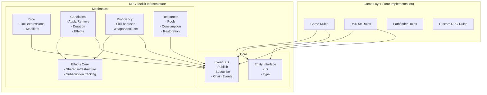
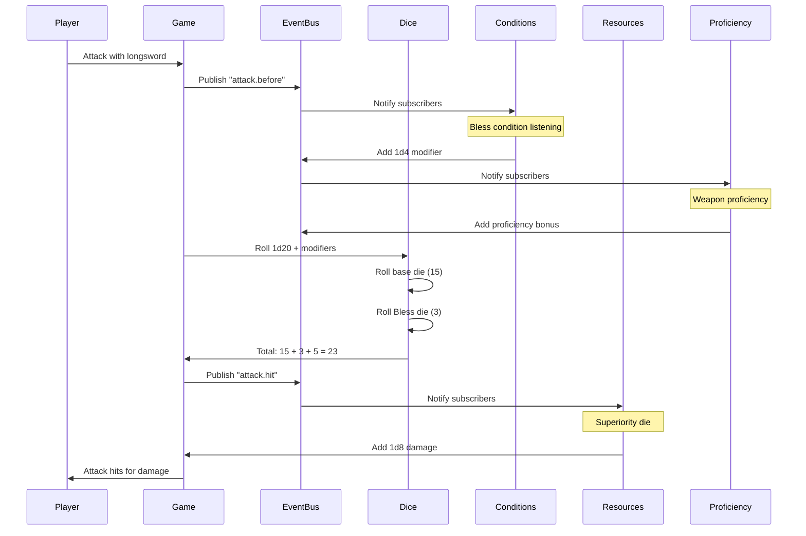
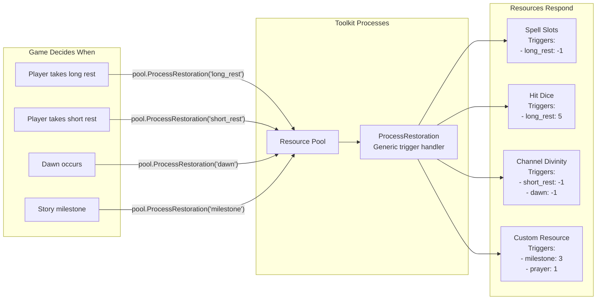
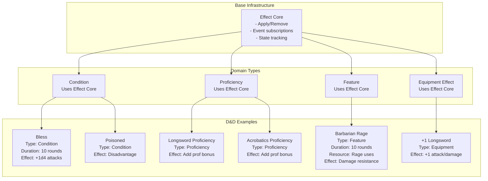
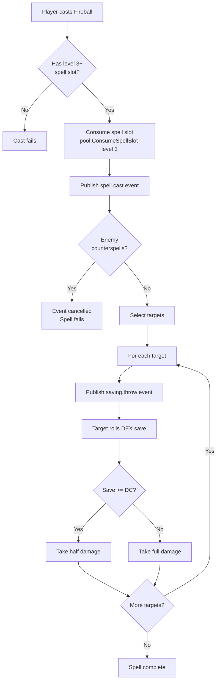

    # RPG Toolkit Architecture Diagram

## Overview
RPG Toolkit provides infrastructure for tabletop RPG mechanics through an event-driven architecture. Games implement their specific rules using our generic tools.

## Core Architecture



## Event Flow Example: D&D 5e Attack with Bless



## Component Interaction: Rest Mechanics



## Effect Composition Pattern



## Key Design Principles

1. **Infrastructure, Not Implementation**: Toolkit provides generic event handling, games define what "poisoned" means
2. **Event-Driven Communication**: Modules don't call each other directly, they communicate through events
3. **Composition Over Inheritance**: Effects are composed from behaviors, not inherited from base classes
4. **Game-Agnostic Triggers**: Resources restore on "dawn", not "D&D long rest"

## Example: Spell Casting Flow



## Benefits of This Architecture

- **Extensibility**: New mechanics don't require toolkit changes
- **Modularity**: Each component can be used independently  
- **Testability**: Components can be tested in isolation
- **Flexibility**: Games can implement any rule system
- **Reusability**: Common patterns (conditions, resources) work across different games

## D&D 5e Implementation Example

```go
// Game layer defines D&D-specific rules
type DnD5eGame struct {
    eventBus *events.Bus
    pools    map[string]resources.Pool
}

// Initialize a character with D&D mechanics
func (g *DnD5eGame) CreateWizard(level int) {
    wizard := &Character{ID: "wizard-1", Type: "character"}
    pool := resources.NewSimplePool(wizard)
    
    // D&D-specific spell slots
    spellSlots := resources.CreateSpellSlots(wizard, map[int]int{
        1: 4, // 4 first level slots
        2: 3, // 3 second level slots  
        3: 2, // 2 third level slots
    })
    
    // D&D-specific rest mechanics
    for _, slot := range spellSlots {
        pool.Add(slot) // Already configured for long rest
    }
    
    // Listen for D&D rest events
    g.eventBus.Subscribe("game.long_rest_completed", func(e Event) {
        pool.ProcessRestoration("long_rest", g.eventBus)
    })
    
    // Listen for dawn (some D&D abilities refresh at dawn)
    g.eventBus.Subscribe("time.dawn", func(e Event) {
        pool.ProcessRestoration("dawn", g.eventBus)
    })
}
```

This architecture allows rpg-toolkit to support any tabletop RPG system while maintaining clean separation between generic infrastructure and game-specific rules.