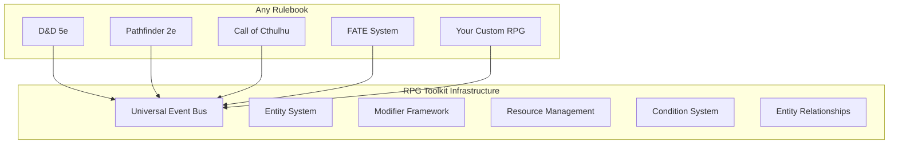
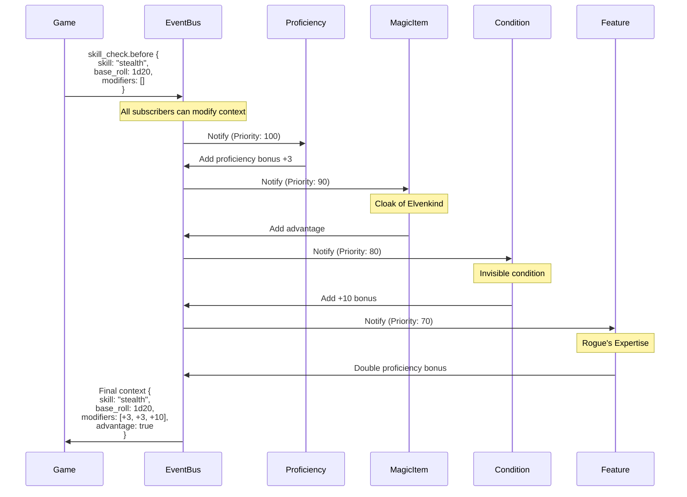
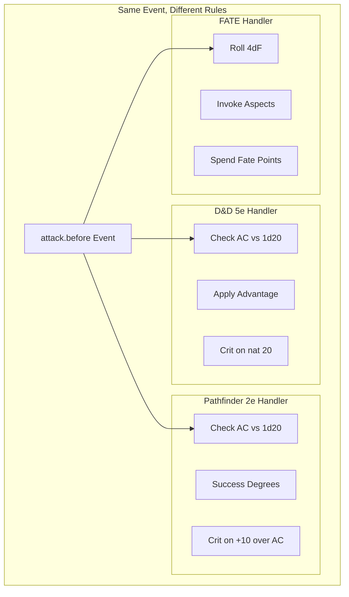
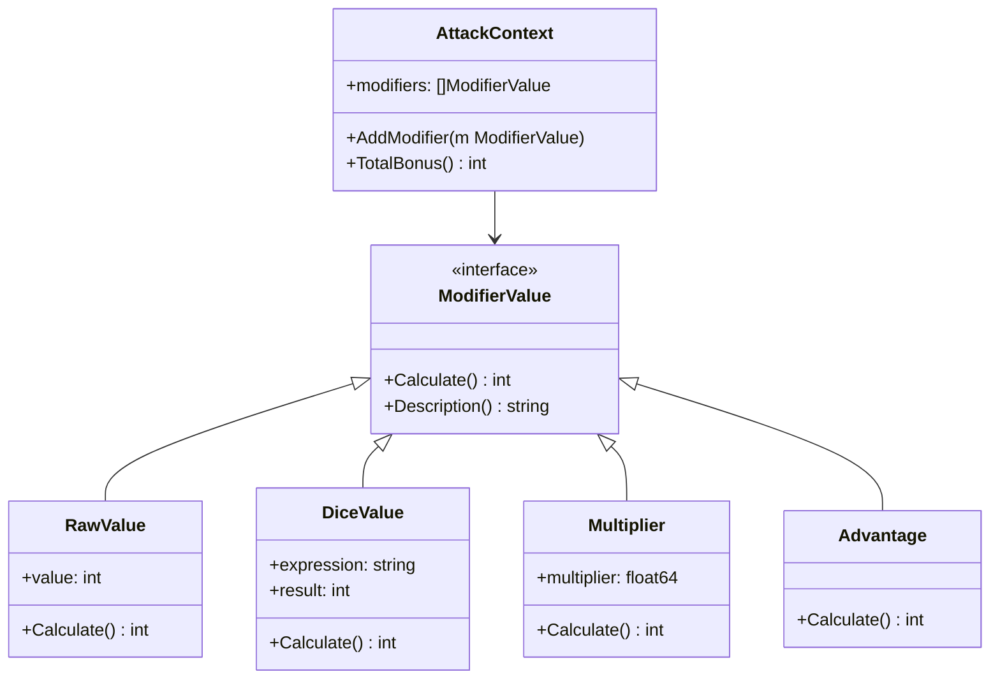
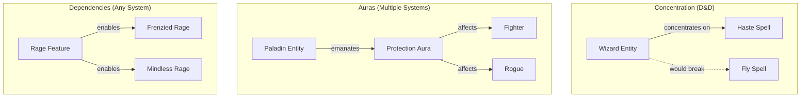
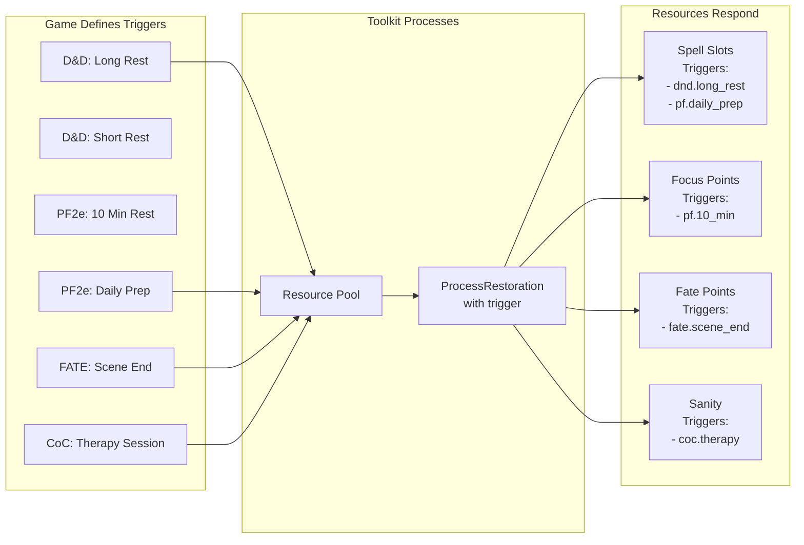
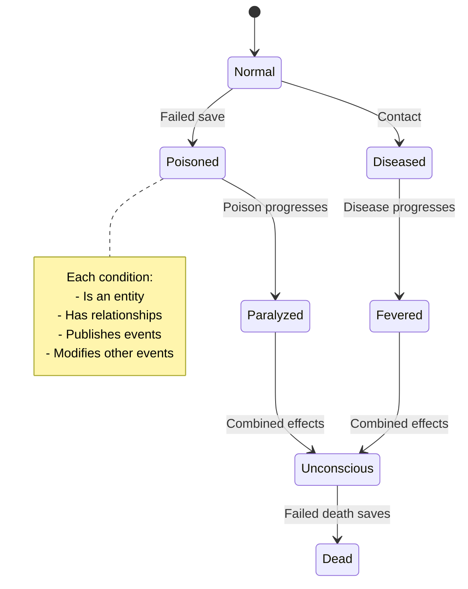
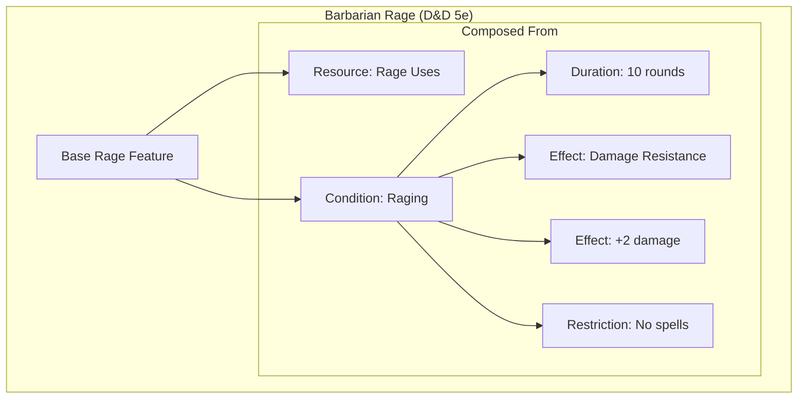
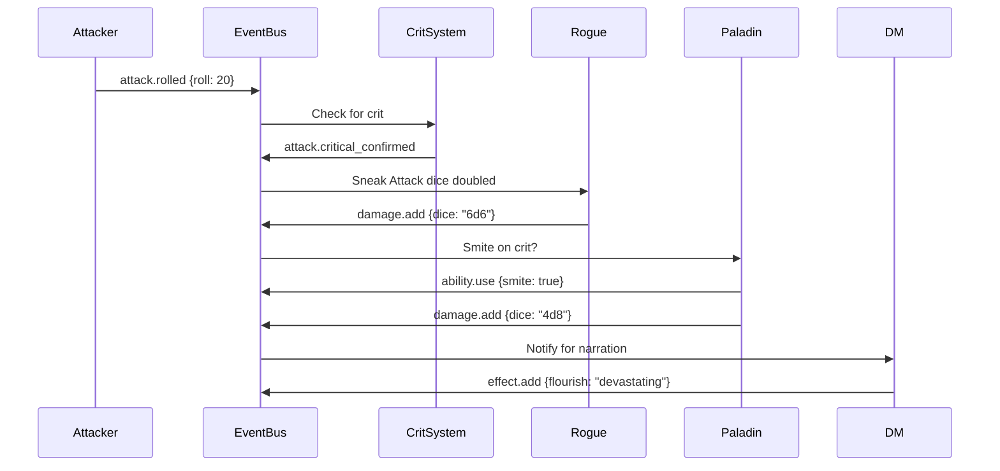

# RPG Toolkit: Architecture Vision & Capabilities

## The Vision

RPG Toolkit is a universal infrastructure for tabletop RPG mechanics. It provides the engine - you provide the rules.



## Core Power: The Event-Driven Architecture

### Rich Event Context & Modification



### Multi-System Combat Example



## The Modifier System: Type-Safe Flexibility



### Example: Complex Modifier Stacking

```go
// D&D 5e Paladin Attack with multiple modifiers
eventBus.Subscribe("attack.before", func(ctx context.Context, e Event) error {
    attack := e.(*AttackEvent)
    
    // Base modifiers
    attack.AddModifier(RawValue{5})           // +5 STR
    attack.AddModifier(RawValue{3})           // +3 proficiency
    attack.AddModifier(RawValue{1})           // +1 magic weapon
    
    // Conditional modifiers
    if attack.Target.HasTag("undead") {
        attack.AddModifier(DiceValue{"1d8"})  // Divine Strike
    }
    
    // Buffs
    if HasCondition("bless") {
        attack.AddModifier(DiceValue{"1d4"})  // Bless (rolled fresh)
    }
    
    // Debuffs
    if HasCondition("frightened") {
        attack.AddModifier(Disadvantage{})    // Disadvantage
    }
    
    return nil
})
```

## Entity Relationships: Modeling Complex Interactions



## Resource Management: Universal Patterns



## Real-World Use Cases

### 1. Running Multiple Systems Simultaneously

```go
// Same table, different characters, different rules!
type MultiSystemGame struct {
    eventBus *events.Bus
    dndHandler *DnD5eRules
    pfHandler *Pathfinder2eRules
    fateHandler *FATERules
}

func (g *MultiSystemGame) Initialize() {
    // Each system subscribes to same events with different logic
    g.dndHandler.Subscribe(g.eventBus)
    g.pfHandler.Subscribe(g.eventBus)
    g.fateHandler.Subscribe(g.eventBus)
}

// When a character acts, their system's rules apply
func (g *MultiSystemGame) CharacterAttacks(char Entity) {
    g.eventBus.Publish("attack.initiate", AttackEvent{
        Attacker: char,
        System: char.GetTag("system"), // "dnd5e", "pf2e", etc
    })
}
```

### 2. Homebrew Magic System

```go
// Custom spell system with unique mechanics
type ElementalMagic struct {
    eventBus *events.Bus
}

func (em *ElementalMagic) Subscribe(bus *events.Bus) {
    // Custom resource: Elemental Attunement
    bus.Subscribe("spell.before_cast", func(ctx context.Context, e Event) error {
        spell := e.(*SpellEvent)
        
        // Check elemental alignment
        if !em.HasAttunement(spell.Element) {
            e.Cancel() // Can't cast without attunement
            return nil
        }
        
        // Consume attunement points instead of spell slots
        pool := GetPool(spell.Caster)
        err := pool.Consume(fmt.Sprintf("attunement_%s", spell.Element), 1, bus)
        if err != nil {
            e.Cancel()
        }
        
        return nil
    })
    
    // Environmental bonuses
    bus.Subscribe("spell.calculate_damage", func(ctx context.Context, e Event) error {
        spell := e.(*SpellDamageEvent)
        
        // Near volcano? Fire spells do more
        if spell.Element == "fire" && IsNearVolcano(spell.Location) {
            spell.AddModifier(Multiplier{1.5})
        }
        
        return nil
    })
}
```

### 3. Complex Condition Interactions



### 4. Time-Based Mechanics

```go
// Different time systems for different games
type TimeSystem interface {
    Subscribe(bus *events.Bus)
}

// D&D: Rounds (6 seconds)
type DnDTime struct{}
func (d *DnDTime) Subscribe(bus *events.Bus) {
    bus.Subscribe("time.round_end", func(ctx context.Context, e Event) error {
        // Reduce condition durations
        // Restore reactions
        // Trigger round-based effects
        return nil
    })
}

// Narrative: Scenes
type FATETime struct{}
func (f *FATETime) Subscribe(bus *events.Bus) {
    bus.Subscribe("time.scene_end", func(ctx context.Context, e Event) error {
        // Clear temporary aspects
        // Restore fate points
        // Reset scene-based resources
        return nil
    })
}
```

## The Power of Composition

### Building Complex Features



### Event Chain Example: Critical Hit



## Extensibility Examples

### Adding New Systems
- **Vampire: The Masquerade**: Blood pool resources, hunger dice, humanity
- **Shadowrun**: Edge points, initiative passes, cyberware
- **Kids on Bikes**: Collaborative advantages, powered character aspects

### Custom Mechanics
- **Corruption System**: Gradual transformation with event thresholds
- **Faction Reputation**: Entity relationships affecting all interactions
- **Weather Magic**: Environmental conditions modifying spell effects

### Tool Integration
- **VTT Integration**: Events drive visual effects and automation
- **AI Game Master**: Subscribe to events for narrative generation
- **Analytics**: Track all events for balance analysis

## Conclusion

RPG Toolkit's architecture enables:
- **True Multi-System Support**: Run any RPG on the same infrastructure
- **Deep Customization**: Every rule can be modified through events
- **Clean Separation**: Infrastructure vs implementation
- **Extensible Design**: New features without breaking existing code
- **Performance**: Event priorities and smart subscription management
- **Debugging**: Full event history and state tracking

The toolkit is not just infrastructure - it's a foundation for the future of digital tabletop gaming.