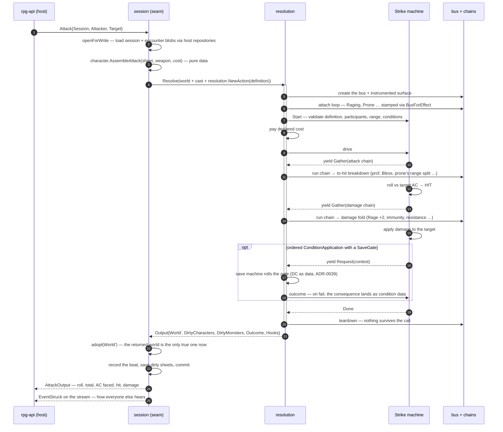
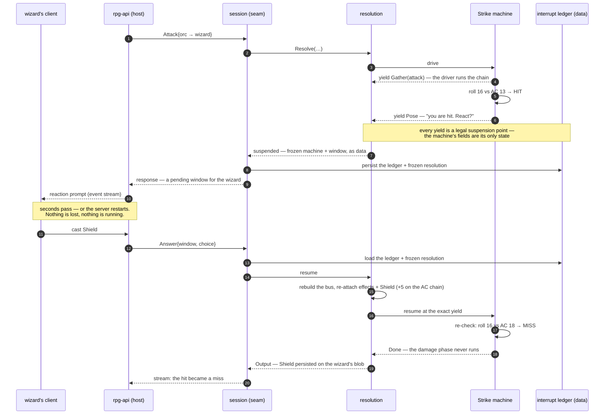

# How It Plays: Use Cases in Sequence

**Companion to** [`resolution/ARCHITECTURE.md`](../../rulebooks/dnd5e/resolution/ARCHITECTURE.md).
That doc is the *structural* map — what the parts are and where a rule lives.
This one is the *temporal* map — what actually happens, in order, when a verb
runs. One use case per section; each new capability wave adds its case in the
same PR that makes it true (the co-location rule).

Every case carries an honest badge, because a use-case doc that reads the same
whether or not the feature exists is a named defect class here:

- **SHIPPED @ \<versions\>** — this sequence runs today; the diagram is
  checkable against the code and its tests.
- **DESIGNED — wave N** — the vocabulary supports it and the diagram shows the
  intended shape; nothing runs yet.

---

## UC-1 — A character swings a sword · SHIPPED @ rpg-toolkit#1198

The bread-and-butter path (`session/attack.go`): rpg-api calls one verb with
IDs, and everything between — compile, bus lifetime, machine, chains — happens
inside a single `Resolve` and dies with it. This is ADR-0038 end to end.

What each hop proves:

- **1–3**: the seam takes IDs and blobs only; character assembly produces the
  same inert definition monster factories author directly.
- **6–7**: the one place a bus is born; the attach loop stamps attribution, so
  "this effect subscribed nothing" is an assertable fact in `Hooks`.
- **9, 12**: the machine never touches the bus — it *yields* `Gather` and the
  driver runs the chain. R6 by construction.
- **15–17**: a contested rider is data (`SaveGate`), not a branch in the
  machine. (Reachable via monster actions today; v1 refuses monster
  *attackers* at the seam by name — that case belongs to the behavior work.)
- **19–24**: teardown, adopt, record, save. The host learned nothing about
  rules; the stream — not the RPC response — is how the table hears about it.
- **Preflight before payment**: invalid range or condition declarations roll
  nothing and consume nothing. Resolution charges the caller-supplied cost only
  after `Start` succeeds.

---

## UC-2 — The wizard's Shield: an attack that pauses · DESIGNED — wave 5 (Pose)

The case the whole shape was built for. An orc's attack roll *hits* the
wizard; a reaction window opens **between the roll and the damage**; the
wizard casts Shield (+5 AC until their next turn), and the hit becomes a miss.
The pause is real — it survives the RPC returning, and even the process dying —
because a suspended resolution is nothing but data.

Why this is drawn now, before it runs:

- **6–8**: `Pose` is the one step kind not yet driven — it arrives with wave 5
  reactions. The custody it needs (`play/interrupt`: Pose, Answer, PendingFor,
  a validated persisted ledger) already exists and must not be rebuilt.
- **7, 13–16**: "re-enterable by construction" is already pinned in shipped
  machines — this diagram is that property paying off, not new design.
- **15**: the bus died with the first call; resume makes a *new* one and
  re-attaches from data. There is no session process to keep alive.
- **17–18**: order matters and the machine owns it: miss means the damage
  phase never runs. That sequencing is exactly why Strike is a machine and
  Shield is a chain subscriber — check ARCHITECTURE.md's "where a rule lives"
  table.

---

## The catalog — cases waiting for their wave

Each of these gets its diagram in the PR that ships it:

| Use case | What it will demonstrate | Arrives with |
|---|---|---|
| A walk that stops at first sight | the trigger at `refreshSight`; a bubble forms | shipped — worth back-filling |
| A fight ends by defeat | endings as data, the #964 mirror | #1024 |
| Monster bites back | monster attackers through the behavior work | behavior lane |
| Action economy spends | Turn choosing actions, Requesting machines below it | #1035 |
| Multiattack | Request(strike) × N — the economy loop | economy |
| Fireball | no attack roll; per-target save-for-half | breath-weapon machine |
| Grapple on hit | Imposes *without* a gate — direct consequence | second gated condition |
