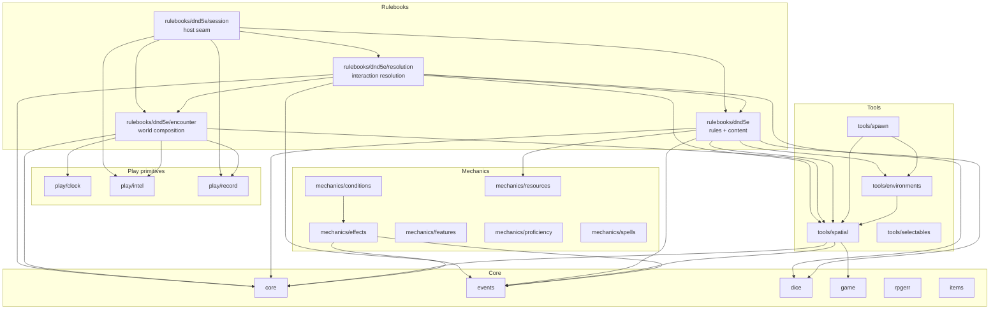
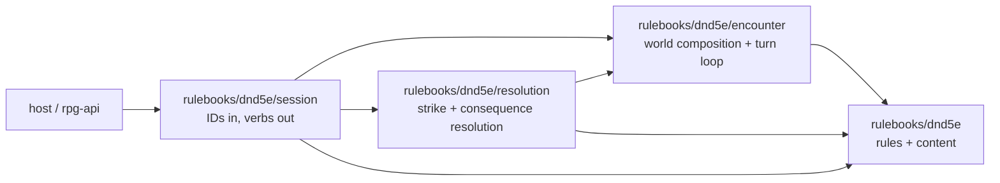

# rpg-toolkit architecture overview

## Toolkit as product

rpg-toolkit is the product. Any game host using the toolkit should be able to ship their game by writing UI and content — the engine and its delivery shape should feel small. rpg-api (our reference game server) and rpg-dnd5e-web (our reference Discord Activity UI) are not platform components; they are the worked example for one host shape (gRPC + Redis + React + Discord). A different host — a single-player desktop client, a different multiplayer transport, a tabletop simulator — should be able to point at the same toolkit without touching it.

That framing has two operational consequences worth naming up-front, since they steer every SDK design call:

1. **When rpg-api grows complex, that is signal the toolkit is missing a primitive.** The boundary rule below ("toolkit knows rules, api orchestrates by key") is a constraint that catches drift: any rule logic that finds its way into rpg-api should produce a toolkit issue, not a rpg-api fix.
2. **Verb shape lives in the SDK, not the orchestrator.** Wave 2.11d's `PhasedCombatResolver` is the canonical example: the host implements a resolver, but the SDK owns the verb sequence (`TakeActionPhased` → `CompleteTakeAction`), the persistence shape (`PendingReactionPrompts`), and the pause-and-resume contract (`errNPCPausedForReaction`). Wave 2.11e extends the same pattern to a second resolver verb (`MovementResolver`). A new host doesn't have to re-derive any of this — they implement the resolver interface and the SDK does the rest.

## Mandate

rpg-toolkit is a Go rules engine for tabletop RPG mechanics. Its mandate is to implement game rules and return rich breakdowns. It never orchestrates data, never persists state, and never knows about rpg-api or proto definitions. If a caller (rpg-api) needs to know what Rage does, it asks the toolkit.

## Layer rules & module dependency map

**Higher layers may import lower; reversing is a defect.** The diagram shows the
current supported D&D 5e stack after retiring the top-level `encounter/` module:
`rulebooks/dnd5e` owns rules and content, `rulebooks/dnd5e/encounter` owns the
D&D 5e composition/world state, `rulebooks/dnd5e/resolution` owns interaction
resolution, and `rulebooks/dnd5e/session` is the host seam. Everything sits at
or below the Rulebooks layer, and **nothing imports rpg-api or
rpg-api-protos** (the toolkit never knows its host).



Nodes are modules. Arrows are dependencies; uniform ones are omitted for
legibility — for example, several leaves depend on `core` and `events` without
needing their own edge here. **Maintenance rule:** update this diagram in the
same PR as any module move. Historical note: ADR-0034 proposed moving the loop
inside `rulebooks/dnd5e` and extracting new primitives, but that proposal is
superseded as current guidance by the shipped separate modules
`rulebooks/dnd5e/encounter`, `rulebooks/dnd5e/resolution`, and
`rulebooks/dnd5e/session`.

## The persistence pattern

Every stateful toolkit component implements exactly two methods:

```go
func (c *Character) ToData() *Data { ... }
func LoadFromData(ctx context.Context, data *Data, bus events.EventBus) (*Character, error) { ... }
```

The data orchestrator (rpg-api) holds the serialized `Data` struct (typically as JSON in Redis). When it needs the character to participate in a rule call, it calls `LoadFromData` to reconstitute the live object, invokes the rule, then calls `ToData` again to serialize the result. **The toolkit never opens a database connection, never reads from Redis, and never persists anything.**

This pattern is present in:
- `rulebooks/dnd5e/character/character.go` — `Character.ToData()` / `LoadFromData()`
- `rulebooks/dnd5e/character/draft_data.go` — `Draft.ToData()` / `LoadDraftFromData()`
- `tools/environments/environment_persistence.go` — `BasicEnvironment.ToData()` / `LoadFromData()`
- `tools/spatial/data.go` — `RoomData` serialization, `LoadRoomFromContext()`

Conditions and features use a JSON variant of the same pattern:
- `ToJSON() (json.RawMessage, error)` — serialize active state
- `LoadJSON(data json.RawMessage) (ConditionBehavior, error)` — reconstitute from JSON blob

The difference: `LoadFromData` is used when the data schema is homogeneous (one struct type per entity); `LoadJSON` is used when the loader routes by ref (multiple condition/feature types serialized to the same opaque blob field).

Monster reload currently composes both forms and is explicitly multi-step: `monster.LoadFromData` restores the base entity, `monster/actions.LoadMonsterActions` restores polymorphic actions, and `monstertraits.LoadMonsterConditions` routes and applies trait JSON. The encounter hydration cascade owns all three. See the [current monster README](../../rulebooks/dnd5e/monster/README.md).

## The boundary rule

```
Client sends REFERENCES (keys, IDs) → never calculations
API orchestrates by KEY             → never knows what Rage does
Toolkit implements RULES            → returns rich breakdowns for rendering
```

Toolkit's job ends when it returns a `Breakdown` struct. The breakdown contains the full modifier chain — base value, per-modifier deltas, sources, labels — so the UI can render the reasoning without re-implementing rules.

## The D&D 5e stack: rules, composition, resolution, and host seam

The current seam runs across four supported modules. `rulebooks/dnd5e` owns the
rules and content packages. `rulebooks/dnd5e/encounter` owns the D&D 5e world:
map, perception, story, turn loop, and composition state. `rulebooks/dnd5e/resolution`
owns attack/interaction resolution over encounter/world data plus participant
sheets. `rulebooks/dnd5e/session` is the game server seam: repository and event
interfaces in, ID-based verbs and translated outputs out.



That split is the current supported shape. Historical note: ADR-0034 proposed a
different end-state in which the loop moved inside `rulebooks/dnd5e`; that
proposal is no longer current guidance, and the deleted top-level `encounter/`
module is historical only.

## Module map

| Module | Path | Layer | Purpose |
|---|---|---|---|
| core | `core/` | Core | Entity, EntityType, Ref, TypedRef, Action, chain types |
| rpgerr | `rpgerr/` | Core | Structured error accumulation with RPG context |
| dice | `dice/` | Core | Roller, Pool, LazyRoll, Modifier, Notation |
| events | `events/` | Core | EventBus, BusEffect, TypedTopic, ChainedTopic |
| game | `game/` | Core | game.Context pattern for passing game state through event chains |
| items | `items/` | Core | Item/EquippableItem/WeaponItem interfaces — base only, no implementation |
| play/clock | `play/clock/` | Play primitive | Explicit clock state and advance contracts |
| play/intel | `play/intel/` | Play primitive | Viewer knowledge/intelligence facts and merge contracts |
| play/interrupt | `play/interrupt/` | Play primitive | Owned interruption windows and answer custody contracts |
| play/record | `play/record/` | Play primitive | Append-only play record contracts |
| mechanics/effects | `mechanics/effects/` | Mechanics | Shared effect infrastructure (tracker, behaviors) |
| mechanics/conditions | `mechanics/conditions/` | Mechanics | Condition manager, simple/enhanced condition types |
| mechanics/resources | `mechanics/resources/` | Mechanics | Resource pools (spell slots, ki, rage uses) |
| mechanics/features | `mechanics/features/` | Mechanics | Feature loader infrastructure |
| mechanics/proficiency | `mechanics/proficiency/` | Mechanics | Proficiency system |
| mechanics/spells | `mechanics/spells/` | Mechanics | Spell slots, concentration, spell list |
| tools/spatial | `tools/spatial/` | Tools | Hex/Square/Gridless room + multi-room orchestration |
| tools/environments | `tools/environments/` | Tools | Environment persistence, graph generation, multi-room dungeon graph |
| tools/selectables | `tools/selectables/` | Tools | Weighted random selection tables |
| tools/spawn | `tools/spawn/` | Tools | 4-phase entity spawn engine |
| rulebooks/dnd5e | `rulebooks/dnd5e/` | Rulebooks | Currently supported D&D 5e rules and content: character, combat, initiative, spells, monsters, dungeon |
| rulebooks/dnd5e/encounter | `rulebooks/dnd5e/encounter/` | Rulebooks (D&D 5e) | D&D 5e encounter composition and world state: map, perception, story, turn loop, prompts |
| rulebooks/dnd5e/resolution | `rulebooks/dnd5e/resolution/` | Rulebooks (D&D 5e) | D&D 5e interaction resolution: compiled attacks, chains, consequences, folded outcomes |
| rulebooks/dnd5e/session | `rulebooks/dnd5e/session/` | Rulebooks (D&D 5e) | Host-facing session seam: repository/event interfaces, ID-based verbs, translated outputs |

## Code violations against these rules (2026-05-02)

### Rule: No local `replace` directives on main
**Violated by two modules committed to main (verified 2026-08-10):**
- `mechanics/conditions/go.mod` — 4 replace directives (`core`, `dice`, `events`, `effects`)
- `mechanics/spells/go.mod` — 6 replace directives (`core`, `dice`, `events`, `conditions`, `effects`, `resources`)

Tracked in issue #613. These work locally but break CI because published module resolution fails when directives are present.

### Rule: Higher layers only; Tools is not Rulebooks
**Potential violation: `rulebooks/dnd5e/dungeon/` inside the rulebook:**
The `dungeon/` package (`dungeon.go`, `dungeon_data.go`, `types.go`) provides procedural dungeon generation that architecturally belongs at the Tools layer (so rpg-api can use dungeon logic without importing the full dnd5e rulebook). It uses `tools/environments` and `tools/spatial` (both lower layers — that direction is correct), but its location makes `rulebooks/dnd5e` the only consumer path. The planned move is to `tools/dungeon/` or a new top-level module. No issue or branch exists yet.

### Rule: Test coverage at the rule layer
**Violated by `rulebooks/dnd5e/backgrounds/grants.go` (172 lines) and `rulebooks/dnd5e/races/grants.go` (109 lines):**
Both files implement grant logic (skill proficiencies, language grants, weapon and armor grants by race). Neither has a `*_test.go` file. Verified: `find rulebooks/dnd5e/backgrounds -name "*_test.go"` returns empty. Tracked in issue #615.

**Violated by `mechanics/features/` base module:**
`loader.go`, `feature.go`, `simple_feature.go` — no test files in the base module. Only `mock/` exists. Feature loader is tested indirectly via `rulebooks/dnd5e/features`. Direct unit tests for routing and error paths are absent.

### Rule: Square-grid intra-room pathfinding
**Gap: `PathFinder` interface is hex-only (`tools/spatial/pathfinder.go:9`):**
```go
FindPath(start, goal CubeCoordinate, blocked map[CubeCoordinate]bool) []CubeCoordinate
```
`CubeCoordinate` is the hex coordinate type. There is no `SquarePathFinder`. A monster navigating obstacles inside a square room has no toolkit path to follow. The orchestrator's `FindPath` is room-to-room only. Tracked in issue #614.

## Testing approach

- **Testify suite pattern** — `suite.Suite` + `SetupTest()` + `s.Run()` throughout
- **Uber gomock** — mocks in `mock/` subdirectory per module
- **Per-module tests** — each module is tested in isolation: `cd <module> && go test ./...`
- **Integration tests** — `rulebooks/dnd5e/integration/` covers full Barbarian/Fighter/Monk/Rogue encounter scenarios

Run tests:
```bash
# Single module
cd /home/kirk/personal/rpg-toolkit/core && go test -race ./...

# All modules (Makefile target)
make test-all

# Full pre-commit (fmt + tidy + lint + test for core + events)
make pre-commit
```

Note: `make pre-commit` only covers `core` and `events`. For other modules run per-module `go test ./...` and `golangci-lint run ./...` manually before committing.
