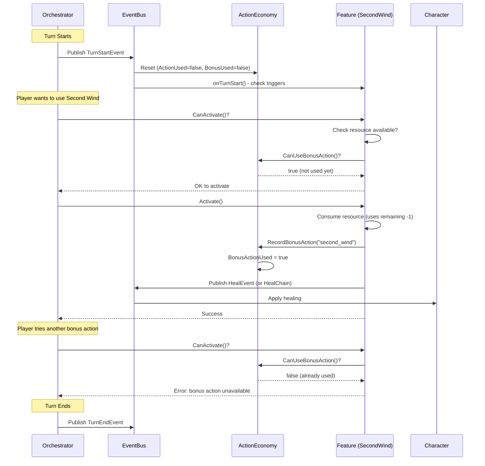
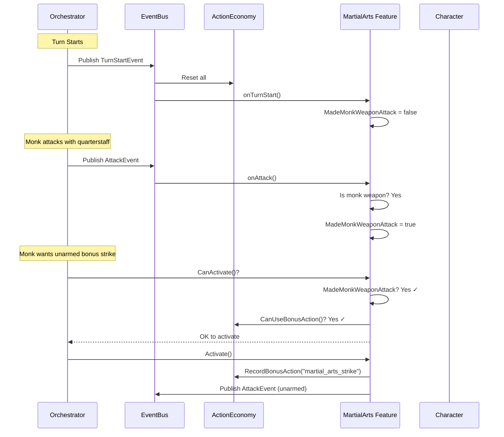

# Action Economy Flow Diagrams

These diagrams show how action economy integrates with the combat system for issue #387.

## Basic Bonus Action Flow (Second Wind)

## Conditional Bonus Action Flow (Martial Arts)

Shows how a bonus action becomes available based on a trigger (making a monk weapon attack).

## Key Design Decisions

### ActionEconomy is State, Not Events

ActionEconomy tracks per-turn state:
- `ActionUsed bool`
- `BonusActionUsed bool`
- `ReactionUsed bool`

Events flow through it:
1. `TurnStartEvent` → resets ActionEconomy
2. Features query ActionEconomy for permission
3. Features update ActionEconomy when activated
4. `TurnEndEvent` → any cleanup

### Where ActionEconomy Lives

**Decision:** ActionEconomy lives in the `combat` package since:
- Action economy only matters during combat (turn-based)
- Free roam mode won't have action restrictions
- Combat is the container for turn-based mechanics

### Component Summary

| Component | Type | Purpose |
|-----------|------|---------|
| ActionEconomy struct | State | Track action/bonus/reaction used this turn |
| TurnStartEvent | Event | Already exists - triggers reset |
| TurnEndEvent | Event | Already exists - triggers cleanup |
| HealEvent/HealChain | Event | New - for healing flow |
| RestEvent | Event | New - triggers resource recovery |
| ResourceConsumedEvent | Event | New - for Ki/ability tracking |
