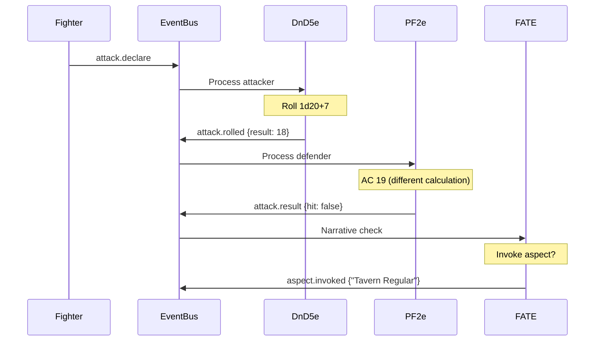

# Multi-System Example: The Tavern Brawl

This example demonstrates how RPG Toolkit can run multiple game systems simultaneously at the same table.

## Scenario
A magical tavern where heroes from different worlds meet. Each character follows their own world's rules, but they can interact!

## The Characters

```go
// D&D 5e Fighter
fighter := &Character{
    ID: "bjorn-ironside",
    Type: "character", 
    System: "dnd5e",
    Level: 5,
}

// Pathfinder 2e Rogue
rogue := &Character{
    ID: "shadowstep",
    Type: "character",
    System: "pf2e", 
    Level: 5,
}

// FATE Core Detective
detective := &Character{
    ID: "sam-spade",
    Type: "character",
    System: "fate",
    Aspects: []string{"Hard-Boiled Detective", "Seen It All"},
}

// Call of Cthulhu Investigator
investigator := &Character{
    ID: "prof-armitage", 
    Type: "character",
    System: "coc",
    Sanity: 65,
}
```

## System Handlers

```go
// Each system subscribes to the same events but handles them differently
type GameMaster struct {
    eventBus *events.Bus
    systems map[string]SystemHandler
}

func (gm *GameMaster) Initialize() {
    // Register all systems
    gm.systems["dnd5e"] = &DnD5eHandler{}
    gm.systems["pf2e"] = &Pathfinder2eHandler{}
    gm.systems["fate"] = &FATEHandler{}
    gm.systems["coc"] = &CallOfCthulhuHandler{}
    
    // Each system subscribes to events
    for _, system := range gm.systems {
        system.Subscribe(gm.eventBus)
    }
}
```

## The Brawl Begins!

### Round 1: Initiative

```go
// Each system handles initiative differently
gm.eventBus.Publish("combat.start", CombatEvent{
    Participants: []Entity{fighter, rogue, detective, investigator},
})

// D&D 5e: 1d20 + DEX
// Output: "Bjorn rolls initiative: 17"

// Pathfinder 2e: 1d20 + Perception  
// Output: "Shadowstep rolls initiative: 22"

// FATE: No initiative, narrative order
// Output: "Sam will act when dramatically appropriate"

// Call of Cthulhu: DEX order
// Output: "Professor acts on DEX 60"
```

### Round 2: Attacks

```go
// Fighter attacks with his sword
gm.eventBus.Publish("attack.declare", AttackEvent{
    Attacker: fighter,
    Target: rogue,
    Weapon: "longsword",
})
```

The event flows through each system:



### Round 3: Magic and Madness

```go
// The investigator sees something terrible
gm.eventBus.Publish("horror.witnessed", HorrorEvent{
    Witness: investigator,
    Horror: "Eldritch Abomination",
    Description: "The beer tap transforms into writhing tentacles",
})

// Only Call of Cthulhu handler responds
// Output: "Professor must make Sanity check: 1d100 vs 65"
// Output: "Failed! Loses 1d10 Sanity"

// But the horror affects everyone!
gm.eventBus.Publish("environment.changed", EnvironmentEvent{
    Effect: "eldritch_presence",
})

// Each system interprets differently:
// D&D 5e: "Make a Wisdom save vs fear"
// PF2e: "Make a Will save vs mental effect"  
// FATE: "Compel aspect: 'Seen It All' - gain a Fate point"
// CoC: "Everyone makes Sanity checks!"
```

### Round 4: Resource Management

```go
// Short rest is called
gm.eventBus.Publish("rest.short", RestEvent{
    Duration: "10 minutes",
})

// Each system responds differently
eventBus.Subscribe("rest.short", func(ctx context.Context, e Event) error {
    for _, character := range GetAllCharacters() {
        pool := GetPool(character)
        
        switch character.System {
        case "dnd5e":
            pool.ProcessRestoration("dnd.short_rest", eventBus)
            // Restores: Hit dice usage, some abilities
            
        case "pf2e":
            pool.ProcessRestoration("pf2e.treat_wounds", eventBus)
            // Restores: HP with Medicine check
            
        case "fate":
            // FATE doesn't have short rests
            // But clears temporary aspects
            
        case "coc":
            pool.ProcessRestoration("coc.first_aid", eventBus)
            // Restores: 1d3 HP if injured
        }
    }
    return nil
})
```

## Complex Interactions

### Buff Spell Across Systems

```go
// The FATE detective uses an aspect to help everyone
gm.eventBus.Publish("aspect.create", AspectEvent{
    Creator: detective,
    Aspect: "The Odds Are In Our Favor",
    Targets: []Entity{fighter, rogue, investigator},
    FreeInvokes: 2,
})

// System handlers translate the FATE aspect
eventBus.Subscribe("aspect.create", func(ctx context.Context, e Event) error {
    aspect := e.(*AspectEvent)
    
    for _, target := range aspect.Targets {
        switch target.System {
        case "dnd5e":
            // Translate to Inspiration
            gm.eventBus.Publish("effect.add", EffectEvent{
                Target: target,
                Effect: "inspiration",
                Duration: "until used",
            })
            
        case "pf2e":
            // Translate to Hero Point
            resources := GetPool(target)
            resources.Add(CreateHeroPoint(target))
            
        case "coc":
            // Translate to Luck points
            target.SetAttribute("luck", target.GetAttribute("luck") + 1)
        }
    }
    return nil
})
```

### Environmental Hazard

```go
// Tavern catches fire!
gm.eventBus.Publish("hazard.environmental", HazardEvent{
    Type: "fire",
    Area: "whole_tavern",
    SaveDC: 15,
})

// Each system handles differently
type FireHandler struct{}

func (f *FireHandler) Handle(ctx context.Context, e Event) error {
    hazard := e.(*HazardEvent)
    
    for _, character := range GetCharactersInArea(hazard.Area) {
        switch character.System {
        case "dnd5e":
            // DEX save or take 2d6 fire damage
            gm.eventBus.Publish("save.required", SaveEvent{
                Character: character,
                Ability: "DEX",
                DC: hazard.SaveDC,
                Failure: "damage.fire.2d6",
            })
            
        case "pf2e":
            // Basic Reflex save
            gm.eventBus.Publish("save.basic", SaveEvent{
                Character: character,
                Save: "reflex",
                DC: hazard.SaveDC,
                CritSuccess: "no_damage",
                Success: "half_damage.2d6",
                Failure: "damage.fire.2d6",
                CritFailure: "double_damage.2d6",
            })
            
        case "fate":
            // Overcome action vs Good (+3) difficulty
            gm.eventBus.Publish("action.overcome", OvercomeEvent{
                Character: character,
                Skill: "Athletics",
                Difficulty: 3,
                FailureConsequence: "mild_consequence.burned",
            })
            
        case "coc":
            // Dodge roll or take damage + Sanity check
            gm.eventBus.Publish("skill.check", SkillEvent{
                Character: character,
                Skill: "Dodge",
                Failure: "damage.1d6+sanity_check",
            })
        }
    }
    return nil
}
```

## Unified Combat Log

Despite different systems, we get a coherent narrative:

```
=== TAVERN BRAWL LOG ===
[Initiative] Shadowstep (PF2e) acts first with 22
[Initiative] Bjorn (D&D) rolled 17
[Initiative] Sam (FATE) will act when dramatically appropriate
[Initiative] Professor (CoC) acts on DEX 60

[Attack] Bjorn swings his longsword at Shadowstep
  > D&D 5e: Rolls 18 (1d20+7)
  > PF2e: Against AC 19 - MISS
  > Sam invokes "Tavern Regular" to create an advantage

[Horror] The beer tap transforms into tentacles!
  > Professor fails Sanity check (rolled 78 vs 65)
  > Professor loses 7 Sanity (1d10)
  > Bjorn makes WIS save vs fear (DC 13) - Success!
  > Shadowstep makes Will save - Critical Success!
  > Sam's "Seen It All" is compelled - gains Fate point

[Environment] Tavern catches fire!
  > Bjorn: DEX save (15) vs DC 15 - Success! No damage
  > Shadowstep: Reflex save (23) - Critical Success! No damage
  > Sam: Athletics overcome (+2) vs Good (+3) - Tie! Success at cost
  > Professor: Dodge (45%) - Failed! Takes 4 damage and loses 2 Sanity

[Rest] Quick breather (10 minutes)
  > Bjorn uses Hit Die: Heals 8 HP
  > Shadowstep: Treat Wounds - Heals 12 HP
  > Sam: Clears "Singed Eyebrows" temporary aspect
  > Professor: First Aid - Heals 2 HP
```

## Key Takeaways

1. **Same Events, Different Rules**: Each system interprets events according to its own rules
2. **Cross-System Buffs**: FATE aspects become D&D inspiration, PF2e hero points, etc.
3. **Unified Narrative**: Despite mechanical differences, the story flows seamlessly
4. **System Fidelity**: Each character follows their native system's rules exactly
5. **Extensible**: Adding a new system just means adding a new handler

This is the power of RPG Toolkit's event-driven architecture!