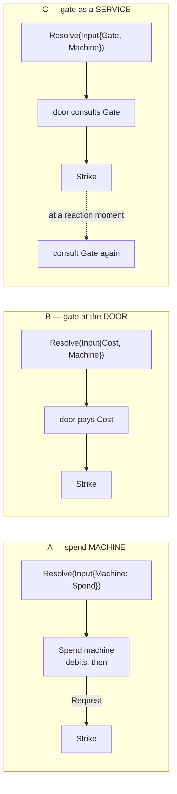

# The economy gate: where an action's cost lives

**Date:** 2026-08-18
**Status:** open question space. Nothing here is ratified. This is the
trade-off conversation that happens *before* E1 freezes the spend vocabulary.
**Decides:** nothing. The evidence is the [#1035 census][census] and its
[supplement][supp] and [movement addendum][move]; this doc does not re-derive
any of it. What it does is lay three shapes side by side and walk each one
through the same four cases.

**Verified against** `main` at `b3287ae`.

[census]: https://github.com/KirkDiggler/rpg-toolkit/issues/1035#issuecomment-5326154182
[supp]: https://github.com/KirkDiggler/rpg-toolkit/issues/1035#issuecomment-5326242250
[move]: https://github.com/KirkDiggler/rpg-toolkit/issues/1035#issuecomment-5326344695

## The question

Nothing in the new stack spends anything yet, so the cost of an action has no
home and no owner. Before the first spend exists we get to choose the shape
rather than inherit it — and the shape is not obvious, because the cost of an
action is three separable things: **where the cost is written down** (a
profile, compiled per actor, because a monk's bonus strike and a rogue's Dash
cost differently from the same nominal action), **who checks it can be paid**
(before anything happens, or at the moment the thing happens), and **who
debits the ledger** (and onto whose sheet). Kirk's framing puts it as a gate:

> There's a gate to get into the machine and that gate has the cost. maybe more
> than one cost. maybe that cost is dynamic based on the class… when an action
> is going to be taken we should know what it cost and the action economy is
> where that cost is paid from.

with two riders that shape everything below:

> A machine maybe doesn't have a cost and that's okay. it can just be taken.

> Character shaped gates is really important. the wizard spends their reaction
> for that turn only if they have it. if they used it on their turn there is
> nothing to pause for. if they do spend it it comes off their sheet.

## Three shapes

- **(A) A spend machine wrapping the strike.** The census's F6-literal sketch:
  a machine whose steps are "debit, then `Request` the interaction below".
  Costs nothing architecturally — a new machine over existing sealed steps is
  priced "cheap and safe — cannot touch the bus" (`resolution/ARCHITECTURE.md:144`).
- **(B) A gate at `Resolve`'s door.** A compiled cost profile rides `Input`
  beside the machine, and resolution debits before calling `Machine.Start`.
  Cost and interaction become independent fields.
- **(C) A gate as a service resolution can consult at any action moment.** The
  same profile, reached through a capability on `Input` — consulted at the
  door, and again wherever an action moment appears inside a resolution.

### Case (i) — the level-5 fighter's three swings

One action buys two attacks; the third swing is refused. Two `Attack` verbs in
one turn are two processes, so the bank lives on the sheet either way.

| | |
|---|---|
| **A** | Spend machine reads the sheet, debits the action if the bank is empty, banks 2, spends 1, `Request`s the strike. Second call: bank non-empty, spend 1 only. Third: refused before the strike runs. |
| **B** | Identical, except the arithmetic is at the door and the strike machine never learns economy exists. |
| **C** | Identical to B. |

**Discriminates: nothing.** All three handle the headline case. Worth stating
plainly — the case that motivated the issue does not choose the shape.

### Case (ii) — Dash: a spend with no machine behind it

Dash spends an action and grants movement. There is no interaction to resolve:
no roll, no target, no chain.

| | |
|---|---|
| **A** | A "machine" whose entire body is a debit and a `Done`. Expressible, but it names a machine where there is no interaction — the vocabulary's own rule is that a machine's identity is its *yield-shape*, and this one yields nothing. |
| **B** | Natural. `Cost` set, `Machine` nil (or trivially `Done`). Kirk's "a machine maybe doesn't have a cost" is the same independence read the other way. |
| **C** | Natural, same as B. |

**Discriminates: A.** Shape A conflates the cost with the interaction, so a
cost without an interaction has to wear a machine's clothes. Note this case is
currently hypothetical at the seam — there is no Dash verb in `session` — but
it is the shape of every non-attack action in the catalogue (Dodge, Disengage,
Help, Hide).

### Case (iii) — the wizard's Shield

A fighter swings at Aldric. Mid-resolution, after the roll and before damage,
Aldric may cast Shield as a **reaction** — and only if he still has one.

This case is already modelled as a nine-beat test,
`play/interrupt/shieldscene_test.go`, with Aldric as audience and
`["shield","decline"]` as options.

| | |
|---|---|
| **A** | The spend machine above the strike has already finished — it debited the *fighter's* action. The wizard's reaction is a **different actor's cost, discovered inside the interaction**. To express it, the strike machine would have to `Request` a spend machine for somebody else, which puts economy inside the strike — the exact thing the census argued the machine must never hold. |
| **B** | **Cannot express it.** At the door, the actor is the fighter and the cost is the fighter's. The wizard's reaction is not knowable there: whether a window even opens depends on a fact discovered several steps into somebody else's resolution. |
| **C** | The natural case. When the strike reaches a reaction moment, the spine consults the gate — *can Aldric afford Shield?* — **before** posing. No reaction, no window. If he answers "shield", the gate debits his reaction off his sheet. |

**Discriminates: B (fails), A (only by breaking its own rule).** This is the
case that separates the shapes, and Kirk's eligibility insight is what makes it
sharp:

> the wizard spends their reaction for that turn only if they have it. if they
> used it on their turn there is nothing to pause for.

That is not a UI nicety — it decides whether the window exists. And the ledger
cannot decide it: `interrupt.Pose` validates the audience and the option tokens
and nothing else, because the module is deliberately "custody, not execution"
and "never interprets an option, a choice, or a payload byte"
(`play/interrupt/doc.go`). **So somebody must consult the economy before
`Pose` is called.** Under C that somebody is the gate. Under A or B there is
no one holding the question.

### Case (iv) — suspension: the strike pauses and the process dies

A window is open; the server restarts before anyone answers. Was the action
spent?

Today the answer is clean and the same for all three: **nothing was spent**,
because a failed resolution persists nothing — "a refused resolution leaves
nothing on a bus and no half-written sheet" (`resolution/doc.go:82-85`), and
`session.Attack` returns before `adopt`/`saveDirty` on any resolution error
(`session/attack.go:213-215`). Failure refunds are free because failure writes
nothing.

Suspension is different from failure, and that is the open part:

| | |
|---|---|
| **A / B** | The cost was paid before the interaction started. If a suspension persists the frozen resolution and the process later resumes *from the window* rather than from the top, the debit must have been persisted alongside the frozen payload — or it is lost on resume (free action) or re-applied (double charge). |
| **C** | The fighter's door-cost has the identical problem. Aldric's reaction does not: under C it is debited **at the answer**, so a window that is never answered spent nothing, which is also the correct 5e reading. |

**Discriminates: partially.** Nobody escapes the door-cost-plus-suspension
question; C removes it for the reaction half by paying later. Note this is
wave-5-shaped, not hypothetical-forever: `Pose` is the sealed vocabulary's
unbuilt fourth case, and the movement addendum found that the docs still
promise it arrives with a walk machine that #964 never built
(`ARCHITECTURE.md:96,162`, `resolution/doc.go:133-136`), while
`session/doc.go:88-118` records reactions as the first honest producer.

## The cross-cutting facts any shape must respect

Established in the census and its addenda; cited, not re-argued.

1. **The profile is compiled per actor, in the rulebook.** Class-dynamic cost —
   Kirk's "maybe that cost is dynamic based on the class" — is the compiler's
   business, following `AttackFromCharacter`. The machine holds no class table.
   The repo has the anti-pattern three times: the monk hardcode
   (`character/action_economy.go:592-607`), the ref→resource switch (`:742-763`),
   and Dash's two constructors baking cost into object identity
   (`combatabilities/dash.go:29-41` vs `:43-55`).
2. **The ledger is on the sheet.** Three verbs in one turn are three processes;
   only persisted sheet state survives between them.
3. **Keyed, never fielded.** `combat.ActionEconomy` grew a named field per
   feature; its persisted twin replaced them with `Granted map[GrantedActionKey]int`,
   and the bridge between the two shapes maps only three of five keys.
4. **Per-unit movement cost stays out of the profile.** "Spend N of capacity K";
   what N is for a path is the path's business, or difficult terrain can never
   be added.
5. **The sealed vocabulary is `Gather | Pose | Request | Done`**, and extending
   it costs an ADR (ADR-0038).

### Does B or C need an ADR? — honestly, probably yes, and not for the reason the census assumed

The census said "no ADR" on the strength of the socket table: a new machine
over existing steps is cheap. **That reasoning covers shape A only.**

B and C do not add a step kind, so ADR-0038's stated trigger is not pulled. But
they change what `resolution.Input` *means*, and there is a specific law in the
way. R2 reads "**Everything at the seam is data.** No runtime object crosses
into or out of [Resolve]" (`resolution/doc.go:34-36`). Four capabilities
already ride `Input` — `Deciders`, `Initiative`, `Standing`, `Roller` — and the
package rationalises them as pass-through rather than exceptions: `Standing`'s
own field doc says "**Carried, never consulted.**"

A cost gate would be **the first capability resolution itself consults.** That
is a real change to the package's self-description, and under C it is consulted
at a suspension point that does not exist yet. Calling that additive would be
the kind of claim ADRs exist to stop. So: **A is ADR-free; B and C want one**,
and C's would have to be written with `Pose` rather than before it.

## Open questions

Front and centre, because these are the conversation.

1. **Which shape?** Case (iii) is the discriminating one, and it is not a
   corner case — it is wave 5. But choosing C now means designing a consult
   point for a suspension mechanism nobody has built. Is it better to ship A or
   B for v1 and pay a migration when reactions land, or to choose the shape
   that survives reactions before writing the first debit?
2. **One ledger behind the gate, or several?** Per-turn slots, granted
   capacity, pools (ki) and slots have different cadences and, today, different
   homes. Does the gate present one debit surface over all of them, or is
   "spend an action" and "spend a ki" two verbs to the caller?
3. **Pools and spell slots through the same system — genuinely unresolved.**
   Ki is a keyed pool with a `ResetType`; a spell slot is keyed by *level* with
   no reset field, and upcasting means a 3rd-level spell may eat a 5th-level
   slot. Same gate, or a different one? Kirk's own read is that this is unclear,
   and nothing in the code forces it either way yet.
4. **The eligibility read.** "Could Shield fire?" is the may-I-act question in
   reaction clothes, and it is now two questions: the server needs it to decide
   whether to open a window at all, and a client may want it to grey a button.
   Same read, or does the server-side one stay internal?
5. **Refunds.** 5e says no. Today the question does not arise, for a verified
   reason: failure persists nothing. Suspension is where it becomes real — and
   the honest answer may be that a suspended resolution must persist its debit
   with its frozen payload, which makes the debit part of the suspension
   contract rather than the economy's.
6. **What does wave 5 need the gate to already be?** If the answer is "a thing
   the interrupt spine can ask before posing", that is C, and it is worth
   knowing now rather than after E1.

## What each shape does to E1–E3

E0 (dirty-marking) is ruling-independent and already dispatched.

| | A | B | C |
|---|---|---|---|
| **E1** cost compiler | unchanged — profile compiled in the rulebook | unchanged | unchanged |
| **E2** the spend | a `Spend` machine in resolution | a field on `Input` + a debit step at the door | a capability on `Input` + a consult at the door, and a second consult point reserved |
| **E3** session one-liner | hands `Resolve` the spend machine | hands `Resolve` a cost beside the machine | hands `Resolve` a gate beside the machine |

**E1 survives all three unchanged**, which is the useful result: the compiler
and the profile are common ground, so E1 can proceed on the census's ruling
while this conversation continues. What changes between shapes is E2 — where
the debit happens — and E3's one line.

## What would make this doc wrong

- If reactions turn out not to need an eligibility check before posing — if a
  window may open and be refused at answer time — case (iii) stops
  discriminating and B becomes as good as C.
- If the per-actor profile cannot express a second actor's cost at all, then
  no shape solves case (iii) and the reaction economy is a separate mechanism
  from the action economy, which would be worth knowing before either is built.
- If `Pose` arrives shaped so that a machine can consult supplied capabilities
  directly, C stops being a distinct shape and becomes A with a longer reach.

— census-1035 agent, on behalf of KirkDiggler
