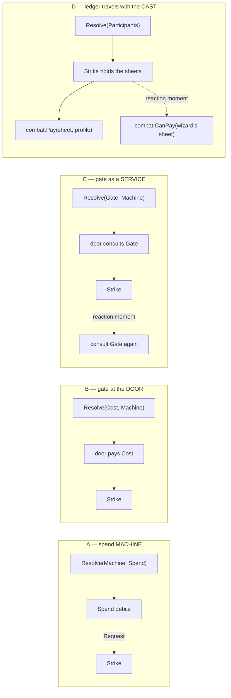

# The economy gate: where an action's cost lives

**Date:** 2026-08-18
**Status: DECIDED 2026-08-18.** Kirk: *"really happy with how this turned out I
approve and am excited to get started on 1035."*
**Decides:** the **foundation** — shape **D**'s substance (the ledger rides the
cast as data; the gate is pure `CanPay`/`Pay` in `combat`) + casts assembled by
**interested-by-declaration**, closed by construction + **machines yield, the
runner spends**, the ledger denied to machines exactly as the bus is + **debits
ride answers**, with *auto* a zero-latency window and *ask* a `Pose` plus an
`Answer` door + **the door pays a compiled data profile** in v1, which is what
keeps the whole thing ADR-free. Restated in full in *Decided* at the bottom.
**Does not decide:** the eight open questions, each parked with the wave that
owns it.
The evidence is the [#1035 census][census] and its [supplement][supp] and
[movement addendum][move]; this doc does not re-derive any of it. What it does is
lay four shapes side by side and walk each one through the same cases — the
argument is kept rather than collapsed, because a ruling is only as good as the
reasoning that produced it.

**Verified against** `main` at `b3287ae`.

**Update, 2026-08-22 — fork (d) retiring (rpg-toolkit#1169).** The movement
addendum's fork (d) said "nothing charges movement in v1" because no
in-fight movement verb existed to charge. Kirk's direction ("take turn,
move maybe, end turn, monster takes turn") pulls that verb in now rather
than waiting for the reaction wave the addendum expected. This is the "new
slice (E8)" the addendum named, not a re-litigation of the ruling above:
movement is the keyed capacity (`combat.CapacityMovement`) already
reserved for it, priced per call (5 ft/cell, computed outside the profile
per the addendum's row-four discipline) and charged through the same
`combat.Pay` the ruling's foundation already established. First half —
`encounter.Step`'s turn-clock gate — merged as
[#1170](https://github.com/KirkDiggler/rpg-toolkit/pull/1170)
(`encounter/v0.30.1`); the session half that actually calls `combat.Pay`
before a walk and charges the whole requested path — refused whole,
naming the currency in feet, before any step — is
[#1171](https://github.com/KirkDiggler/rpg-toolkit/pull/1171). Fork (d) is
fully retired once #1171 merges.

**Update, 2026-08-22 — Afford prices per target, still one gate call
(rpg-project#249, the combat-turn contract).** Reach (rpg-toolkit#1010) adds
candidates to what `Afford` reports for `VerbAttack` — one `Declaration` per
sighted member within the compiled weapon's reach, rather than the single
declaration this ruling's foundation shipped with. That is a fan-out over
the ANSWER, not a second gate: `combat.Pay` is still called exactly ONCE per
`Afford` call, against the sheet this call loaded, and the resulting
affordable/shortfall is shared across every target declaration — reach
decides the LIST, the economy decides ONE affordable-or-not for all of it.
Paying per candidate was considered and rejected outright: the second call
would see the ledger as if the first had already spent it, since `Pay`
mutates. The `Shortfall` this ruling's `payAtTheDoor` produces is also now
structured (`Reason`/`Currency`/`Needed`/`Left`, not only `Text`), read off
the SAME `SlotsLeft`/`CapacityLeft` state the gate's own check consults —
never by parsing the gate's error string. Neither change touches E1–E3's
foundation; both are the session-side seam this doc always said would keep
growing on top of it.

[census]: https://github.com/KirkDiggler/rpg-toolkit/issues/1035#issuecomment-5326154182
[supp]: https://github.com/KirkDiggler/rpg-toolkit/issues/1035#issuecomment-5326242250
[move]: https://github.com/KirkDiggler/rpg-toolkit/issues/1035#issuecomment-5326344695

## The question

Nothing in the new stack spends anything yet, so the cost of an action has no
home and no owner. Before the first spend exists we get to choose the shape
rather than inherit it — and the shape is not obvious, because the cost of an
action is three separable things: **where the cost is written down** (a
profile, compiled per actor, because a monk's bonus strike and a rogue's Dash
cost differently from the same nominal action), **who checks it can be paid**
(before anything happens, or at the moment the thing happens), and **who
debits the ledger** (and onto whose sheet). Kirk's framing puts it as a gate:

> There's a gate to get into the machine and that gate has the cost. maybe more
> than one cost. maybe that cost is dynamic based on the class… when an action
> is going to be taken we should know what it cost and the action economy is
> where that cost is paid from.

with two riders that shape everything below:

> A machine maybe doesn't have a cost and that's okay. it can just be taken.

> Character shaped gates is really important. the wizard spends their reaction
> for that turn only if they have it. if they used it on their turn there is
> nothing to pause for. if they do spend it it comes off their sheet.

## Four shapes

- **(A) A spend machine wrapping the strike.** The census's F6-literal sketch:
  a machine whose steps are "debit, then `Request` the interaction below".
- **(B) A gate at `Resolve`'s door.** A compiled cost profile rides `Input`
  beside the machine, and resolution debits before calling `Machine.Start`.
- **(C) A gate as a service resolution can consult at any action moment.** The
  same profile, reached through a capability on `Input`.
- **(D) The ledger travels with the cast.** No capability and no callback: the
  gate is two pure functions in `combat` over sheets resolution *already holds*
  — `CanPay(sheet, profile)` and `Pay(sheet, profile)`.

Shape D came out of Kirk's push to keep the seam all-data:

> I would like to find a way to keep it all data… holding out hope there is an
> elegant solution.

**D is not a fourth peer to A, B and C — it is a different axis.** A/B/C answer
*where the debit is called from*; D answers *what the gate is made of*. Once the
gate is pure functions over the cast's sheets, it can be called from a wrapping
machine (A's site), from the door (B's site), or from inside a machine at a
reaction moment (C's reach) — without any of them needing a capability. That is
why it deserves its own section rather than a row in the table.

### Why D is available at all — two verified facts

1. **Resolution already holds every participant's sheet, mutably.** `castFor`
   builds the cast from **every member of the encounter**, and the rule is
   already "anyone whose effects might fire" rather than "the two swinging":

   > EVERY member, not the two swinging: scope is the caller's and applicability
   > is the effect's own predicate (ADR-0038). A bard three cells away whose
   > Bless is running has to be in the room for their subscription to fire

   (`session/attack.go:396-401`, loop at `:411-428`; law R3 at
   `resolution/doc.go:36-41`). So "extend the cast to anyone who might react" is
   **not an extension** — a wizard who is a member of the encounter is already
   in the cast, with a mutable sheet, before any reaction is considered.

2. **A machine already mutates those sheets mid-resolution, bus-free.** The
   strike's damage phase reaches into the cast and writes the target's sheet:
   `combatantFor(m.cast, m.in.TargetID)` (`resolution/strike.go:424`, helper at
   `:624-634`) then `target.ApplyDamage(...)` — commented "**Bus-free, and the
   only phase that is: applying damage is the sheet's own business and takes no
   bus**" (`:443-448`). `character.ApplyDamage` marks the sheet dirty
   (`character/character.go:767`), `Resolve` returns `dirtyCharacters(cast)`
   (`resolve.go:294`, `:413-423`), and `session.saveDirty` writes them
   (`session/attack.go:456-465`).

   **The economy ledger is the same species as hit points**, and `Pay` would be
   the second bus-free phase in exactly the category the first one established.

The structural consequence: **D needs nothing new on `Input`**, so it never
becomes "the first capability resolution consults" and never collides with
`Input.Standing`'s "Carried, never consulted". On the ADR question below, **D
is the only one of B/C/D that stays ADR-free**, and it is ADR-free for the same
reason A is — it adds no vocabulary and no seam concept.

## The cases

### Case (i) — the level-5 fighter's three swings

One action buys two attacks; the third is refused. Two `Attack` verbs in one
turn are two processes, so the bank lives on the sheet either way.

| | |
|---|---|
| **A** | Spend machine reads the sheet, debits the action if the bank is empty, banks 2, spends 1, `Request`s the strike. |
| **B** | Identical, arithmetic at the door; the strike never learns economy exists. |
| **C** | Identical to B. |
| **D** | Identical to whichever call site it is wired at — but the debit is `combat.Pay` on the cast's own sheet, so it rides out through `DirtyCharacters` with no new plumbing. |

**Discriminates: nothing.** Worth stating plainly — the case that motivated the
issue does not choose the shape.

### Case (ii) — Dash: a spend with no machine behind it

Dash spends an action and grants movement. No roll, no target, no chain.

**First, a constraint that applies to all four** (caught in review of this doc):
a nil `Machine` is refused — `Input.Validate` answers `ErrNoMachine`
(`resolution/resolve.go:125-127`). But the error's own doc draws exactly the
distinction this case needs: "**an interaction with nothing to resolve. Distinct
from a machine that finishes immediately, which is legal**"
(`resolution/errors.go:35-37`). So Dash gets a machine that starts and is
immediately `Done` — already legal, already blessed — under *every* shape. "No
machine at all" is not on the table for anyone without a contract change nobody
has argued for.

| | |
|---|---|
| **A** | The immediately-`Done` machine's entire body *is* the debit. Expressible, but it names a machine where there is no interaction — and the vocabulary's own rule is that a machine's "identity is its **yield-shape**", which here is empty. |
| **B** | `Cost` set, machine trivially `Done`. The cost is a field; the empty machine is honest about being empty. Kirk's "a machine maybe doesn't have a cost" read the other way round. |
| **C** | Same as B. |
| **D** | Same as B, with the debit as a `combat.Pay` call rather than a field the door interprets. |

**Discriminates: A, and only mildly.** The correction above shrinks this case's
weight rather than growing it: every shape needs the same trivially-`Done`
machine, so the only real difference is whether the *cost* has to pretend to be
one (A) or can sit beside it (B/C/D). Note the case is currently hypothetical at
the seam — there is no Dash verb in `session` — but it is the shape of every
non-attack action in the catalogue (Dodge, Disengage, Help, Hide).

### Case (iii) — the wizard's Shield

A fighter swings at Aldric. Mid-resolution, after the roll and before damage,
Aldric may cast Shield as a **reaction** — and only if he still has one. Already
modelled as a nine-beat test, `play/interrupt/shieldscene_test.go`.

| | |
|---|---|
| **A** | The spend machine above already finished; it debited the *fighter's* action. Reaching the wizard means the strike must `Request` a spend machine for somebody else — economy inside the strike, the thing the census said the machine must never hold. |
| **B** | **Cannot express it.** At the door the actor is the fighter. Whether a window opens depends on a fact discovered several steps into somebody else's resolution. |
| **C** | Works: the spine consults the gate before posing. Costs a consulted capability, and therefore an ADR. |
| **D** | **Works, with nothing added.** At the reaction moment the strike already holds `m.cast`, and the wizard's sheet is in it (fact 1). `combat.CanPay(wizardSheet, shieldProfile)` is a pure read of data the machine has. No reaction, no window. On the answer, `combat.Pay` debits that same sheet and it rides out through `DirtyCharacters`. |

**Discriminates: B fails; A only by breaking its own rule; C works but pays an
ADR; D works for free.** Kirk's eligibility insight is what makes the case
sharp:

> the wizard spends their reaction for that turn only if they have it. if they
> used it on their turn there is nothing to pause for.

That is not a UI nicety — it decides whether the window exists. And the ledger
cannot decide it: `interrupt.Pose` validates the audience and the option tokens
and nothing else, because the module is deliberately "custody, not execution"
and "never interprets an option, a choice, or a payload byte"
(`play/interrupt/doc.go`). **So somebody must consult the economy before `Pose`
is called** — and under D that somebody is the machine, reading its own input.

**A second problem D dissolves that the others do not:** multiattack. If a
fighter's two swings are two strikes inside one resolution, a wizard who spends
Shield on the first must not be offered it on the second. Under D the later
check reads the **same sheet instance** the earlier debit wrote, so the second
window never opens. Under B or C the debit's visibility depends on whether the
gate's writes are readable mid-resolution — which is a question D never has to
ask.

### Case (iv) — suspension: the strike pauses and the process dies

**There is no resume path today, and that has to be said before anything else
about this case.** Nothing outside `play/interrupt` imports it — the only
mention anywhere else in the repo is prose in `session/doc.go`, which records
that the adapter was retired. `Answer` returns an envelope "for the rulebook to
resume" and nothing calls it. So this case cannot be settled by reading code; it
can only be reasoned about.

What *is* verified is the failure case, which is cleanly the same for all four:
**nothing was spent**, because a failed resolution persists nothing — "a refused
resolution leaves nothing on a bus and no half-written sheet"
(`resolution/doc.go:82-85`) — and `session.Attack` returns before
`adopt`/`saveDirty` on any resolution error (`session/attack.go:213-215`).
Failure refunds are free because failure writes nothing.

| | |
|---|---|
| **A / B / C** | The actor's cost was paid before the interaction started. If a suspension persists the frozen resolution and resume continues *from the window* rather than from the top, that debit must have been persisted alongside the frozen payload, or it is lost on resume (free action) or re-applied (double charge). |
| **D** | The actor's door-cost has the identical problem — D does not rescue it. What D does fix is the **reaction** half: the wizard's `Pay` happens at the *Answer* door, after a fresh load, so a window that is never answered spent nothing, and a reloaded sheet cannot be double-charged by a debit that was never written. |

**Discriminates: partially, and the same way for all four.** The honest reading
is that the actor's pre-suspension debit is a **suspension-contract** question,
not an economy question: whatever freezes a resolution has to decide what
travels with the frozen payload, and the debit is one more thing on that list.

### Case (v) — the opportunity attack on a walk

A creature leaves a threatened square; whoever threatens it may spend a reaction
to swing. Two halves, and they are not equally ready.

**The reactor side is door-computable, with one caveat.** Resolution builds an
`interactionRoom` out of `Input.World` — "The positions are already here",
because `EncounterData.Members` carries every member's room and position
(`resolution/world.go:23-46`). So "who is adjacent to this path" is answerable
from data the door already has. **The caveat is real:** that builder returns
`nil` when the participants do not all share one room (`world.go:63-67`), and
`castFor` passes *every* encounter member — so in a multi-room dungeon with the
party spread out, no room is installed at all (`resolve.go:257-263`). Widening
the cast makes this *more* likely, which is a cost D inherits rather than
creates. Filed as a side-finding below.

**The mover side is not ready at all, and D does not change that.** There is no
in-fight movement verb and no walk machine: `encounter.Move` refuses a member in
a bubble, saying in-fight movement "arrives with the resolution work"
(`encounter/encounter.go:1469-1481`). **So D's OA story lands with the in-fight
movement machine, not before it** — the same conclusion the movement addendum
reached from the other direction.

## The keystone: machines never touch the ledger — the runner does

Everything above left one thing uncomfortable, and Kirk named it: under shape D
the *machine* was doing the checking. That is the wrong hand on the lever, and
the correction is the doc's closing move.

> **A machine never spends. The runner owns both enforcement points.**

**Point 1 — the door.** Resolution's loop pays `Input.Cost` before it starts the
machine: a pure `combat.Pay` over the actor's sheet, which the runner already
holds. A free action is simply a nil cost. **The machine starts already-paid and
knows nothing about it** — it cannot tell a swing that cost an action from one
that cost nothing, which is exactly the ignorance we want, because "what did
this cost" is a rulebook question that was already answered by the compiler.

**Point 2 — the window.** A machine reaching a reaction moment does not go
looking for wizards. It **yields a step describing the moment**, and the runner
interprets it: applies *interested* (declared triggers matching this action) ∩
*affordable* (`CanPay` on the held sheet), and opens a window only for the
survivors. **The machine never learns the wizard exists.**

### Why this is not a new idea — it is ADR-0038's law applied twice

The symmetry is exact, and it is the argument:

| | ADR-0038 (shipped) | This doc (proposed) |
|---|---|---|
| what machines are denied | **the bus** | **the ledger** |
| what they do instead | yield a step naming what they want | yield a step naming the moment |
| who acts | the surface folds the chain | the runner pays / opens the window |
| enforcement | by construction | the same construction |

R6 is the law: "**A machine never sees the bus.** It yields steps; this package
folds chains on its own bus and hands back results" (`resolution/doc.go:47-50`).
And it is enforced structurally rather than by discipline — "a machine yields
sealed steps and *cannot* reach the bus — `Gather`'s workings are unexported,
and the strike machine does not even import the packages that could hand it one"
(`ARCHITECTURE.md:69-72`). A machine also cannot *build* a step: "A machine
cannot construct one directly — it calls a constructor in this package naming
what it wants" (`step.go:37-42`).

**The ledger joins the bus as a thing machines are structurally denied**, by the
identical technique: keep `Pay` where a machine does not import it, and the
denial is a compile error rather than a code-review note.

> **Correction — 2026-08-18, from E2's census ([#1094][e2], PR [#1096][e2pr]).**
> The paragraph above and the *enforcement* row of the table are **wrong about
> the ledger**, and the difference matters because it is the difference between
> a guarantee and a habit.
>
> The bus's denial is structural and stays structural: `Gather`'s workings are
> unexported and a machine cannot construct a step at all, so reaching the bus
> is a compile error. **The ledger has no equivalent seal**, and the reason is
> shape D itself. `drive` hands the machine `*Participants`
> (`resolution/step.go:103`), the `*character.Character` values in it satisfy
> `combat.Ledger` (`character/ledger.go:21`), and `combat.Pay` is an ordinary
> exported function in a package anything may import. So "keep `Pay` where a
> machine does not import it" describes no achievable arrangement: **the sheets
> are the ledger, and the machine already holds them** — which is the same fact
> D was chosen for, working against the denial rather than for it.
>
> **What E2 ships is the checkable half**, and `resolution/doc.go` says that
> rather than repeating the claim above: the runner pays, no machine in the
> package reads or writes an economy, and both are held by review and by test
> rather than by the compiler. It becomes structural only behind a **read-only
> cast view** — a change to *what a machine is handed*, not to where the debit
> is called from — which is now a **named gap filed as [#1095][gap]** rather
> than a property anyone may rely on.
>
> **No falsifier fired and the ruling is unaffected.** The door still pays, the
> runner still spends, and nothing in E2 needed the structural denial to be
> true — it needed only that no machine *does* spend, which is what was built.
> The correction lands here rather than in a side note because this doc's own
> practice is to name what would overturn it: a DECIDED record carrying a false
> load-bearing claim is worse than one carrying a dated correction.

[e2]: https://github.com/KirkDiggler/rpg-toolkit/issues/1094
[e2pr]: https://github.com/KirkDiggler/rpg-toolkit/pull/1096
[gap]: https://github.com/KirkDiggler/rpg-toolkit/issues/1095

### The runner already does this — verified, not asserted

The claim that "the runner interprets yielded steps" is not aspirational. It is
`drive`, the whole of it (`resolution/step.go:103-158`), called once from
`Resolve` (`resolve.go:274`). Its own doc states the shape:

> The loop is the whole driver: a machine yields, resolution acts, the machine
> yields again. Nothing accumulates on the Go stack between yields, which is
> what makes a suspension expressible later — the machine's own state is the
> only state there is.

The body is a type switch over the sealed set — `Done`, `Request`, `Gather`
(`step.go:110-156`) — and the `Request` arm is the exact precedent for point 2:
the machine yields a step *naming another interaction*, and **the runner is what
actually runs it** (`step.go:126`), then feeds the outcome back into the
machine's continuation. A machine that yields "there is a reaction moment here"
and gets resumed with what happened is the same move, one case over.

**And that case already exists in the sealed vocabulary.** `Pose` is named in
ADR-0038's `Gather | Pose | Request | Done` and is simply unbuilt — "Pose waits
for the walk machine" (`doc.go:133-136`), with reactions now the honest producer.
So **point 2 needs no new step kind and therefore no ADR for the vocabulary** —
it is the fourth case landing with the caller that forces it, which is precisely
how the other three arrived.

### What this settles, and what it costs

It settles the call-site question this doc opened with. `Pay` is called **from
the door, by the runner** — shape B's site, carrying shape D's substance (a pure
function over a sheet the runner holds, not a capability it consults). The
combination is why the R2 problem evaporates: there is nothing new on `Input`
except **data** (a cost profile), and data at the seam is what R2 asks for rather
than what it forbids.

The cost is honest and small: `Input` grows a `Cost` field, and the runner grows
two enforcement points. Neither is a vocabulary change. What it buys is that
**no machine, present or future, can spend anything** — including machines
written later by somebody who never read this doc.

### The sharpening: every answerer has a policy, and debits ride answers

The keystone above says windows are opened by the runner and the debit happens
at the answer. That quietly assumed a *human* answerer — and a monster taking an
opportunity attack has no Answer verb to ride. **The doc left that gap unstated
rather than open**, and Kirk closed it from an unexpected direction:

> honestly, I think opportunity attack is going to be toggled to always do it or
> always ask by the players.

**A player toggled to always-take is structurally a monster decider.** Both are
instant answerers. So the window machinery has **one case, not two**: every
candidate surviving *interested ∩ affordable* carries an **answering policy**.

| policy | what the runner does | when the debit lands |
|---|---|---|
| **ask** | opens a `Pose` window and suspends | on the `Answer` verb, later |
| **auto** | answers synchronously, same runner pass | inline, in that pass |

A monster decider is permanently *auto*. The player toggle is **choosing which
kind of answerer you are** — and per reaction kind, not globally, because the
same player may want opportunity attacks taken without asking and still want to
be asked about Shield.

**So the discipline sharpens.** "Doors debit, windows read" was almost right;
the accurate rule is:

> **Debits ride answers.** An answer may arrive synchronously (a policy or a
> decider) or later (a human on the `Answer` verb). The debit rides it either
> way, and nothing else needs to know which happened.

### Verified: the interrupt module already anticipated this

This is not a shape the ledger has to grow into — it was designed for it, and
says so. The module doc:

> Human and machine deciders are indistinguishable here: an auto-taken reaction
> is an ordinary Pose answered immediately by composition.

(`play/interrupt/doc.go:9-11`.) And the Shield scene has **a dedicated beat for
exactly the auto-OA case** — beat 7 poses a window to a monster with options
`["take-oa", "decline"]` and answers it in the same pass, commented "**NO queries
between pose and answer**… the ledger cannot tell a policy answer from a human
one" (`play/interrupt/shieldscene_test.go:135-161`).

Two consequences follow, and both matter:

1. **Auto is a zero-latency window, not the absence of a window.** The pose still
   happens; it is simply answered before anyone can observe it open. Nothing
   bypasses the interrupt spine.
2. **The story records an auto-taken reaction exactly like an asked one**, and
   not by convention — *by construction*, because the ledger cannot distinguish
   them. The audit trail even survives the window's disappearance: `NextID`
   persists across answers "so IDs are never reused within an encounter"
   (`play/interrupt/data.go:31-37`), so a snapshot after everything resolved
   still carries evidence of how many windows were posed.

### What it buys, and Kirk's reason for wanting it

**Suspension becomes the rare path.** Most opportunity-attack traffic resolves
inline, in the pass that raised it, and the table never freezes. That is the
motivation rather than a side effect: this is a **co-op game played in Discord**,
where stopping four players to ask a fifth about an obvious stab is the
difference between a fight and a queue. The machinery that *can* suspend is
still there, unchanged, for the choices that deserve it.

It also shrinks case (iv)'s blast radius. If most reactions never suspend, the
open question about what travels with a frozen resolution applies to a much
narrower set of moments than it first appeared to.

### Named, not decided: where the policy lives

Three candidates, and this doc does not pick:

- **Supplied with the member, the way `Deciders` already are** — which has the
  strongest precedent, since a decider *is* an answering policy for a monster,
  and the parallel is exact.
- **On the sheet**, persisted like the rest of the ledger.
- **A host/table setting**, outside the rules entirely.

Whichever it is, **capabilities are supplied, never defaulted** (#1036's law)
applies with full force: a policy that silently defaults to *auto* would take
reactions on a player's behalf without being asked, and one that silently
defaults to *ask* would freeze the table Kirk is trying to keep moving. Neither
is a safe guess, so it must be supplied.

## Where this leaves the comparison

Reading the cases rather than the intuition:

| | (i) swings | (ii) Dash | (iii) Shield | (iv) suspension | ADR? |
|---|---|---|---|---|---|
| **A** machine | fine | awkward | only by breaking its own rule | door-cost open | no |
| **B** door | fine | natural | **cannot express** | door-cost open | probably |
| **C** service | fine | natural | works | door-cost open | probably, and after `Pose` |
| **D** cast | fine | **no better than A/B** | works, nothing added | door-cost open; reaction half fixed | **no** |

**What the evidence supports:** D gives C's reach at B's price, and it is the
only shape besides A that adds no seam concept. It does *not* win case (ii), and
it does *not* solve the suspension door-cost — no shape does. Its advantage is
concentrated in case (iii) and in the multiattack visibility problem, and it
gets there by using two mechanisms that already ship rather than by adding one.

**What settles the rest:** D on its own leaves the A-versus-B question open —
the debit still has to be *called* from somewhere. The keystone above answers it:
**the door, by the runner.** That is B's call site carrying D's substance, and
the pairing is what makes the R2 objection evaporate — `Input` grows a cost
**profile**, which is data, and data at the seam is what R2 asks for rather than
what it forbids. A capability would have been the violation; a struct field is
not.

### D's obligation, and Kirk's refinement of it — interested-by-declaration

D is only correct while **everyone who might react is already in the cast.**
Today that holds for encounter members and is not a new requirement (fact 1) —
but "pass literally everyone" is a blunt instrument, and Kirk's refinement is to
narrow it by *relevance to the declared action*:

> what cast enters the input? what action is being taken? what can counter that
> action? if it is an attack, a shield would go in because a shield can counter
> that. the key is not shoving every possible thing into the input but only the
> things that can have an effect on it.

**The tension to clear first.** `castFor` passes the whole roster *precisely
because* the session is not allowed to filter: "applicability is the effect's
own predicate (ADR-0038)… deciding they are irrelevant here would be this
package deciding a rule" (`session/attack.go:398-401`). So a narrower cast is
legal **only if the relevance answer comes from the rulebook**, never from the
seam. That is the whole design constraint, and it has a known solution shape.

**The mechanism: a reaction declares its trigger as data.** The house pattern
already exists twice, and both times it was invented to solve this exact class —
"can this be answered before anything runs?":

- **`SaveGate`** declares a contestable consequence's whole contest as data:
  abilities, DC source, success semantics, recurrence. Its own doc says "**It is
  data — content carries it, nothing here executes it**", and names the founding
  complaint: "a stat block could carry a knockdown DC and be lying about whether
  anything read it" (`saves/gate.go:160-173`, ADR-0039).
- **`AttackProfile.Imposes`** declares the consequence itself as data, after
  #1013 found the machine hardcoding prone — with #1014 adding the both-directions
  validation, because "a consequence with no contest is as meaningless as a
  contest with no consequence".

A reaction-shaped feature would declare the same way: Shield as *reacts-to an
attack against me*; an opportunity attack as *reacts-to a creature leaving my
reach*; and the same declaration is what a hook like Bless already expresses
implicitly through its chain subscription. **Cast assembly then becomes
mechanical** — something like `combat.Interested(declaredAction, roster)`,
scanning sheets for declared triggers that match the action about to be taken.
The session hands over an action and a roster and decides nothing; the rulebook
answers who is interested. R3 is not violated, it is *implemented*: applicability
is still the effect's own predicate, only now the predicate is readable before
the bus exists.

**The failure modes are asymmetric, and that asymmetry is the load-bearing
constraint.** Over-inclusion fails safe, by R3's own reasoning — "attaching a
participant who turns out to be irrelevant costs correctness nothing"
(`resolution/doc.go:36-41`): the sheet rides along, its predicates do not match,
nothing fires. Under-inclusion fails **silent**: a wizard left out of the cast
has a Shield that can never fire, no window ever opens, and *no error is ever
produced* — the resolution looks entirely healthy. Nothing distinguishes "had no
reaction" from "was never asked".

So the filter has to be **closed by construction**: a reaction may exist *only*
by declaring its trigger, so that the feature **is** its own index entry and
there is no separate registry anybody can forget to update. That is the rule
ownership already lives under — ADR-0006 keeps "a registry for definitions,
entity-centric storage for ownership. No central who-has-what table", and a
condition exists because it is on the sheet (`character/data.go:73`), not because
a table says so. *(Honest caveat: the precedent transfers on the ownership half,
not the routing half — `conditions.LoadJSON` still routes refs through a switch
(`conditions/loader.go:28+`), which is a build-time registry of a different kind.
#971 is in that neighbourhood.)*

**What composes out of this.** The window's audience becomes the intersection of
two data reads, which is Kirk's two insights joined:

> audience = **interested** (declared trigger matches the action) ∩ **affordable**
> (`CanPay` on the sheet the cast already holds)

Both halves are door-readable, both are data, and D is intact — no capability,
no callback. The same intersection is also exactly the list a client needs to
render "you may react" prompts, which is open question 4 answered by
construction rather than by a new read.

**What it relieves, and what it does not.** Narrowing the cast reduces a cost
that is real and already paid: `castFor` performs a repository read per
character on every verb (`session/attack.go:423-427`), and `standingSeam` does
its own per consult — a cost that scales with **roster size** rather than with
the interaction, which is the wrong axis. It also reduces pressure on
[#1090](https://github.com/KirkDiggler/rpg-toolkit/issues/1090), since a smaller
cast spans rooms less often — but **it does not fix #1090**, whose real answer is
the one-map position question rather than cast width. Do not let this section be
read as closing that issue.

**The honest cost: none of this exists yet.** No feature carries trigger data
today, so `Interested` has nothing to scan and the filter cannot be built. **The
whole-roster rule remains v1's honest behaviour** — over-inclusive, safe, and
paid for — and this section is its designed successor, arriving with the
reaction wave that gives it both its first declarations and its first caller.

## The cross-cutting facts any shape must respect

Established in the census and its addenda; cited, not re-argued.

1. **The profile is compiled per actor, in the rulebook.** Class-dynamic cost is
   the compiler's business, following `AttackFromCharacter`. The machine holds no
   class table. The repo has the anti-pattern three times: the monk hardcode
   (`character/action_economy.go:592-607`), the ref→resource switch (`:742-763`),
   and Dash's two constructors baking cost into object identity
   (`combatabilities/dash.go:29-41` vs `:43-55`).
2. **The ledger is on the sheet.** Three verbs in one turn are three processes.
3. **Keyed, never fielded.** `combat.ActionEconomy` grew a named field per
   feature; its persisted twin replaced them with a keyed map, and the bridge
   between the two maps only three of five keys.
4. **Per-unit movement cost stays out of the profile.**
5. **The sealed vocabulary is `Gather | Pose | Request | Done`**, and extending
   it costs an ADR (ADR-0038).

### Does any shape need an ADR?

The census said "no ADR" on the strength of the socket table pricing a new
machine as cheap. **That reasoning covers shape A only.**

B and C do not add a step kind, so ADR-0038's stated trigger is not pulled. But
they change what `resolution.Input` *means*, and there is a law in the way. R2
reads "**Everything at the seam is data.** No runtime object crosses into or out
of [Resolve]" (`resolution/doc.go:34-36`). Four capabilities already ride
`Input` — `Deciders`, `Initiative`, `Standing`, `Roller` — and the package
rationalises them as pass-through rather than exceptions: `Standing`'s own field
doc says "**Carried, never consulted.**" A cost gate under B or C would be the
first capability resolution itself *consults*, which is a real change to the
package's self-description.

**D pulls neither trigger.** Pure functions in `combat` over sheets already in
`Participants` add no step kind and no capability; the sheets are already data
and already mutated in place. So: **A and D are ADR-free; B and C want one**, and
C's would have to be written with `Pose` rather than before it.

## Open questions

**All eight survive the ruling.** Each belongs to a wave that has not started —
see *Decided* at the bottom.

1. **~~Where is `Pay` called from?~~** Converged: the door, by the runner. What
   remains open underneath it is narrower — whether the runner's window
   enforcement rides `Pose` as its payload or needs its own shape, which is a
   question for whoever designs `Pose` rather than for this doc.
2. **One ledger behind the gate, or several?** Per-turn slots, granted capacity,
   pools and slots have different cadences and, today, different homes. One debit
   surface, or several verbs to the caller?
3. **Pools and spell slots through the same system — genuinely unresolved.** Ki
   is a keyed pool with a `ResetType`; a spell slot is keyed by *level* with no
   reset field, and upcasting means a 3rd-level spell may eat a 5th-level slot.
4. **The eligibility read.** "Could Shield fire?" is the may-I-act question in
   reaction clothes, and it is two questions: the server needs it to decide
   whether to open a window, and a client may want it to grey a button.
   Interested-by-declaration answers both with one intersection — is the read
   the *same* one, or does the client's version want more (why not, not just
   whether)?
5. **What travels with a frozen resolution?** Case (iv) suggests the actor's
   debit is part of the *suspension* contract rather than the economy's. Worth
   settling when `Pose` is designed, not before.
6. **Is "a reaction exists only by declaring its trigger" enforceable?** It is
   what makes a narrowed cast safe, because under D a missing participant stops
   being a missed buff and becomes a missed refusal — and an unfireable Shield
   produces no error at all. Can the compiler or a test make an undeclared
   reaction impossible, or is it a convention somebody eventually breaks?
7. **Where does the answering policy live** — supplied with the member (the
   `Deciders` precedent), on the sheet, or a host setting? And is *auto* allowed
   to be a per-reaction-kind default a host sets once, or must every kind be
   chosen explicitly?
8. **Does the declared trigger vocabulary want to be sealed?** `DCSource` was
   closed because 5e closed it (ADR-0039). Trigger shapes — attacked-by,
   left-my-reach, ally-damaged, spell-cast-nearby — may or may not be a closed
   set, and getting that wrong in either direction is expensive.

## What each shape does to E1–E3

E0 (dirty-marking) is ruling-independent and already dispatched — and note it
becomes **more** load-bearing under D, since every debit reaches storage through
exactly that path.

| | A | B | C | D |
|---|---|---|---|---|
| **E1** cost compiler | unchanged | unchanged | unchanged | unchanged |
| **E2** the spend | a `Spend` machine | a field on `Input` + door debit | a capability on `Input` + two consult points | `combat.CanPay`/`Pay` + one call site |
| **E3** session one-liner | hands `Resolve` the machine | hands `Resolve` a cost | hands `Resolve` a gate | **unchanged if the call site is a machine** |

**E1 survives all four shapes unchanged**, which is the useful result: the
compiler and the profile are common ground, so E1 can proceed on the census's
ruling while this conversation continues.

## What would make this doc wrong

- If reactions turn out not to need an eligibility check before posing, case
  (iii) stops discriminating and B becomes as good as C or D.
- If a sheet in the cast cannot safely carry a debit across a `Request`
  boundary — if a sub-machine gets a different instance — D's central claim
  fails and it collapses into A.
- If the cast cannot be guaranteed complete for reaction purposes, D is unsafe
  in exactly the cases it was chosen for, and C's consult (which can go and ask)
  becomes the honest answer. This is the one that would hurt most, because
  under-inclusion is silent: there is no failing test to write for a window that
  never opened.
- If a reaction's relevance turns out not to be declarable ahead of the
  interaction — if "can this counter that?" genuinely needs the interaction's
  intermediate state — then interested-by-declaration cannot be computed at the
  door, and the whole-roster cast is not a v1 compromise but the permanent
  answer.
- If `Pose` arrives shaped so a machine can consult supplied capabilities
  directly, C stops being distinct and becomes A with a longer reach.

## Side-finding, filed separately

**A multi-room cast silently disables prone's positional split.** `castFor`
passes every encounter member (`session/attack.go:411-428`), and
`interactionRoom` installs no room when participants span rooms
(`resolution/world.go:63-67`, `resolve.go:257-263`). In a multi-room dungeon
with the party spread out — the reference tomb's normal state — no room is
installed for any strike, so prone's advantage-within-five-feet predicate has no
positions to read. The behaviour is documented as intentional ("a machine that
needs positions then refuses"), but the *combination* with pass-everyone-in
means the refusal is the common case rather than the rare one. Not fixed here.

## Decided — 2026-08-18

Kirk, ruling on the shape above:

> really happy with how this turned out I approve and am excited to get started
> on 1035.

### The ruling — the foundation, in five parts

1. **Shape D's substance.** The economy ledger rides the cast as data. The gate
   is not a capability and not a callback: it is pure functions in `combat` —
   `CanPay(sheet, profile)` / `Pay(sheet, profile)` — over sheets resolution
   already holds. The ledger is the same species as hit points and reaches
   storage the same way, through the dirty set.
2. **Casts assembled by interested-by-declaration.** A reaction exists *only* by
   declaring its trigger, so the feature is its own index entry and the filter is
   **closed by construction** — because under-inclusion fails silent. This
   arrives with the reaction wave that brings the first declarations; until then
   **the whole-roster cast remains v1's honest behaviour**, over-inclusive and
   safe.
3. **Machines yield; the runner spends.** No machine touches the ledger. It is
   denied to them by construction, exactly as ADR-0038 denies them the bus — keep
   `Pay` where a machine cannot import it, and the denial is a compile error
   rather than a review note. **Corrected 2026-08-18** — see the
   correction above the *runner already does this* section. The ledger's denial
   is a checkable discipline rather than a compile error, and stays one until
   the read-only cast view of [#1095][gap] exists. The ruling — no machine
   spends — stands exactly as written; only its claimed enforcement mechanism
   was wrong.
4. **Debits ride answers.** Every candidate surviving *interested ∩ affordable*
   carries an answering policy. **auto ≡ decider**: a zero-latency window, posed
   and answered in the same runner pass, debited inline. **ask**: a `Pose` window
   debited at the `Answer` door. Nothing downstream needs to know which happened.
5. **The door pays a compiled data profile.** In v1 the runner pays
   `Input.Cost` before starting the machine — a *profile*, which is data, not a
   capability it consults. That is what keeps R2 satisfied and the whole
   foundation **ADR-free**.

### What this ruling does not cover

**The eight open questions above stay open.** Each is owned by the wave named
beside it — the reaction wave, `Pose`'s design, spellcasting, the movement
machine — and none of them is settled by this ruling. What is decided is the
**foundation**: where the ledger lives, who may spend, and how a debit reaches
storage. What is parked is everything that needs a caller which does not exist
yet. A reader who takes this section as closing question 3 or question 7 has
read it wrong.

The falsifiers in *What would make this doc wrong* stand as written. A decided
doc still names the observations that would overturn it, and if one of them
lands, this section is what gets revisited.

### Slice consequence

> **E1** (the profile compiler and the gate functions, in `combat`) →
> **E2** (the runner's door pays, in `resolution`) →
> **E3** (`session` hands over the cost and flips `TestNothingSpendsYet`)

E0 — economy and pool mutations marking the sheet dirty — is ruling-independent
and already dispatched. It is also the slice everything else rests on: under this
foundation, *every* debit reaches storage through exactly that path.

— census-1035 agent, on behalf of KirkDiggler
