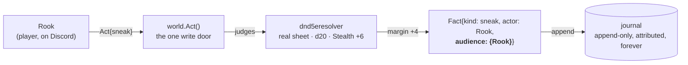
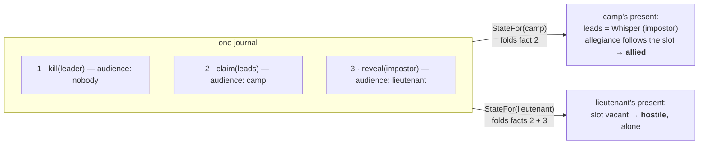
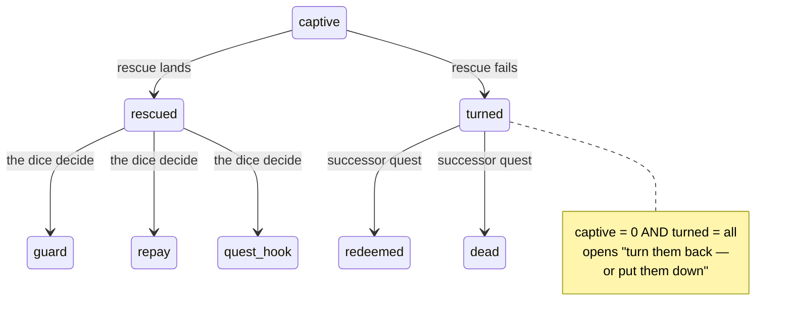
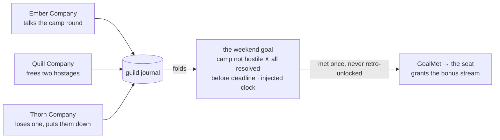
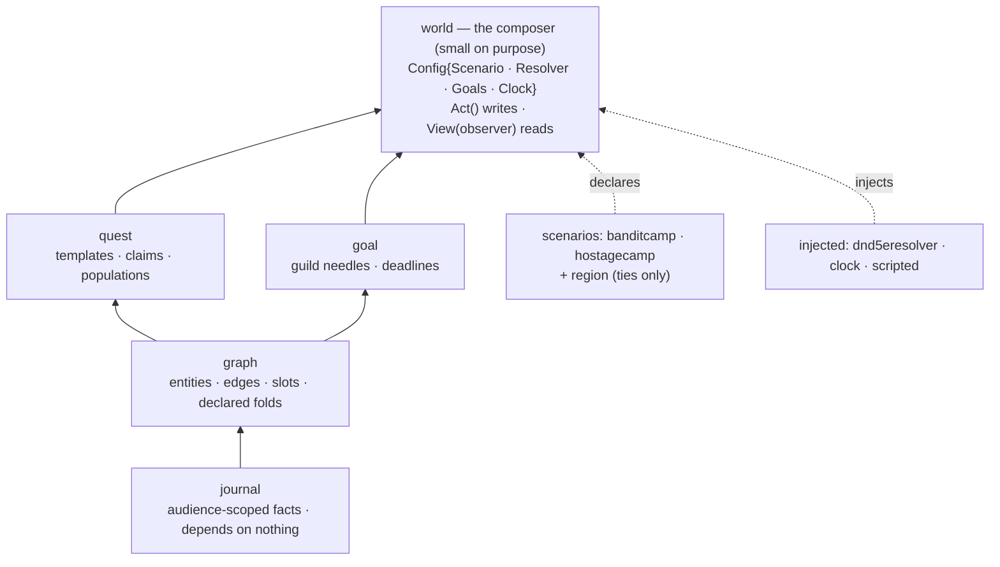

# The Living World

How the game becomes more than a dungeon clearer: every action becomes a
**fact**, facts fold into each witness's **present**, predicates watch the
folds, and the world moves — for one rogue, for one camp, for a whole Discord
server at once. Everything on this page is merged and under test (228 tests,
PRs #1326 · #1328 · #1330; full record in rpg-project#325).

> The designed version of this page lives beside it as
> [`living-world.html`](./living-world.html) — open it in a browser.

## 1 · The life of one act

Rook tries to slip past the bandit camp. No prerequisite is checked — anyone
may attempt anything; the sheet only tilts the dice. What comes out is not
"success" — it is a **fact with an audience**.

A landed sneak and a botched one write the *same kind of fact* — all that
differs is who witnessed it. Stealth is authorship of your own audience.

## 2 · Knowledge is the audience of facts

There is no belief database anywhere. Every observer derives its present by
folding *only the facts it witnessed*.

The blown-disguise test asserts both presents from the same log — and it cost
**zero lines of special-case code**. The ruling that started it: *"our events
are player-detected."* Generalize *player* to *entity* and stealth, disguise,
false belief, and dramatic irony all fall out of one mechanism.

## 3 · Every way in is a check, and no way is gated

Content is the goal, not the path. The barbarian in a goblin costume is a
legitimate play — expertise moves the odds, the dice decide, and each route
differs in *what the camp witnesses* and therefore what fight, if any, you get.

| route | the camp witnesses | result |
|---|---|---|
| **front door** — attack | everything | alerted, formed up; objective via defeat |
| **back way** — sneak | nothing (audience ∅) | unsuspecting; a fight starts surprised |
| **changeling** — quiet kill + claim the slot | only the claim | allegiance follows the impostor; no fight at all |
| **diplomacy** — persuade | the parley | attitude crosses its threshold → allied-with |
| **blown disguise** | reveal reaches one lieutenant | he is hostile; the camp is unchanged |

Five paths, five tests, one declared camp, zero path-specific code. Deeper
routes open *verbs*: in disguise you may work on the leaders' minds.

## 4 · Populations, not quest trees

A claim mints an instance — **your party's hostage is your hostage** — so
parallel parties never collide. The world changes by folding the whole
population; when the fold crosses a declared shape, the next chapter opens
itself.

Failure at scale manufactures act two: the turned hostages are its antagonist
roster, generated by the players' own history. Successes seed content too —
the rescued fill the town with rolled fates. **No outcome is invalid.**

## 5 · One needle for the whole server

The Discord server is the world — one journal, every party writing into it. A
**world goal** is a fold over all of it with a deadline.

Swap which company does what and the result is identical — the tests prove
it. What the unlock *means* belongs to the seat, exactly as what a reward
means belongs to the rulebook.

## 6 · The DM seat and its three tenants

The seat is a client, never the core. It speaks the same verbs as everyone
else, so it can only do what the verbs allow — which bounds a hallucinating
model and a chaos-minded streamer with the same law. Three tenants, ascending
intelligence, one protocol:

1. **Dice tables** — ship with v1: when the world needs a small decision
   nobody authored, roll on a table.
2. **The streamer** — declares world goals, sets deadlines and population
   dials; our tools advise the numbers, the seat decides them.
3. **The local model** — arrives last, onto a road-tested seat: naming
   hostages first, parsing "I search the desk" later, improvising over
   authored content in time.

## 7 · The machine's parts

The kernel never learns a d20 exists; a scenario that shipped its own
resolver would not compile. Everything lives in `examples/world` — its temp
home — until the seams are walked and the packages graduate to `world/*`,
whereupon the example is rewired to import them exactly as a rulebook would.

## 8 · Where this meets the game you already have

| piece | in the living world |
|---|---|
| Discord server | = the world: one guild journal, seats capped and concurrent |
| the town | a thin lobby over Discord's own voice: the quest board, filling with the people the community rescued |
| dungeon runs | instanced as today; outcomes flow back as facts — the run-ending work was quest v0 all along |
| the combat log | the journal is the log that never gets thrown away — same law, bigger clock |
| dungeon builder | scenario packages are its checklist: today's required config is tomorrow's streamer form |
| monster behavior | reads the same folds — the DM seat is the monster seat, grown up |
| NPCs | actors on the same bus, first voices for the model to wear |

## Status

**Merged:** #1326 bandit camp (five paths) · #1328 hostages (populations & the
composer) · #1330 weekend goal (the guild needle). 228 tests, kernel
rulebook-free, freeze untouched throughout.

**Next:** the sight seam — who witnesses an act · then graduation to
`world/*` · post-freeze: opposed checks, chain subscribers, monster skills.
