# Combat Architecture Overview

This is the living reference for anyone working in `rulebooks/dnd5e/combat/`.
It explains how an attack flows from input to applied damage and where each
type lives. It is *not* a decision record — for the decisions behind the damage
chain see [ADR-0026](../../../docs/adr/0026-damage-application-via-event-chain.md),
and for the additional-damage / selective-crit extension see
[ADR-0036](../../../docs/adr/0036-additional-damage-selective-crit.md).

## The two-phase attack resolution

An attack is resolved in two discrete phases so that reactions (Shield,
Protection, opportunity-attack prompts) can fire *between* the hit decision and
the damage roll:

1. **`ResolveAttackHit`** (phase 1) — rolls the d20, runs the `AttackChain` for
   modifiers (advantage, pack tactics, improved-crit threshold), and produces an
   `AttackContext`. Nothing is damaged yet.
2. **Reaction window** — the host offers reactions to the defender; chosen
   `ReactionModifier`s (e.g. Shield's +8 AC) are passed to phase 2.
3. **`ApplyAttackOutcome`** (phase 2) — re-evaluates hit/crit against the
   effective AC, rolls damage, runs the damage chain, and returns the result.
   It publishes `DamageReceivedEvent` but does **not** mutate HP — HP mutation
   is the encounter SDK's job (see "How to trace a monster attack" below).

`ResolveAttack` is a backwards-compatible wrapper that runs both phases with no
reactions. New callers that need reaction windows should call the two phases
directly.

## Where the types live

```
dice/                      dice.Pool, dice.ParseNotation("1d8" -> Pool), dice.Roller
events/                    EventBus, StagedChain
core/                      Ref, Entity
rulebooks/dnd5e/
  damage/                  Type (bludgeoning, acid, ...) · IsPhysical/IsElemental
  weapons/                 Weapon{Damage string, DamageType, Properties[]WeaponProperty}
  events/                  DamageComponent{FinalDiceRolls, FlatBonus, DamageType,
                                    IsCritical, Multiplier}  <- RICH carrier (attacks)
                            DamageChainEvent, AttackChainEvent, DamageReceivedEvent
  combat/                  AttackInput, AttackContext, ResolveAttackHit, ApplyAttackOutcome
                            ResolveDamage, DealDamage, DealDamageInput
                            DamageInstanceInput{Amount int, Type}  <- SIMPLE carrier (spells/cond)
                            calculateFinalDamage, stages (Base/Features/Conditions/Equipment/Final)
  monster/                 MonsterAction, MeleeConfig{DamageDice, DamageType} -> publishes AttackEvent
encounter/  (SDK)           AttackInput{AttackerDamageDice, AttackerDamageType, Attacker, Defender},
                            CombatResolver.ResolveAttack, DamageDealtEvent
```

## The attack damage flow

```mermaid
flowchart TD
    subgraph P1["phase 1 - ResolveAttackHit (attack_phases.go)"]
        direction LR
        AI["AttackInput<br/>Weapon (1d8 bludgeoning),<br/>Roller, EventBus, IDs<br/>v1: AdditionalDamage []DamageComponentSpec"]
        R1["roll d20 -> AttackRoll"]
        AC["AttackChain: advantage,<br/>pack tactics, crit threshold"]
        CTX["AttackContext{AttackRoll, AbilityMod,<br/>CriticalThreshold, Weapon, IsMelee}<br/>v1: + AdditionalDamage"]
        AI --> R1 --> AC --> CTX
    end

    WIN["reaction window - Shield, Protection"]

    subgraph P2["phase 2 - ApplyAttackOutcome (attack_phases.go)"]
        direction LR
        HIT["hit? crit? vs effectiveAC"]
        ROLL["parse Weapon.Damage -> Pool<br/>roll crit?2:1 -> weaponComponent"]
        ABIL["abilityComponent<br/>FlatBonus=AbilityMod, never doubled"]
        ADD["v1: each AdditionalDamage spec<br/>roll ONCE -> DamageComponent<br/>{Type, IsCritical=false}"]
        HIT --> ROLL --> ABIL --> ADD
    end

    subgraph CH["ResolveDamage - the chain (combat/damage.go)"]
        direction LR
        CE["DamageChainEvent{Components:<br/>weapon, ability, additional}"]
        ST["staged chain Base->Features-><br/>Conditions->Equipment->Final<br/>rage, sneak attack, GWF reroll,<br/>resist x0.5, vuln x2, immune x0"]
        CALC["calculateFinalDamage: group by Type,<br/>apply multipliers -><br/>[]DamageInstanceInput{int}  dice->INTS"]
        TOTAL["TotalDamage + FinalComponents"]
        CE --> ST --> CALC --> TOTAL
    end

    subgraph OUT["returns + notifies"]
        direction LR
        AR["AttackResult{TotalDamage, Critical,<br/>Breakdown.Components}"]
        DRE["publish DamageReceivedEvent"]
        AR --> DRE
    end

    subgraph DOWN["DOWNSTREAM - rpg-api / encounter SDK"]
        direction LR
        HP["Target.ApplyDamage -> HP mutation"]
        DDE["encounter DamageDealtEvent{Components}"]
        HP --> DDE
    end

    CTX --> WIN
    WIN --> HIT
    ADD --> CE
    TOTAL --> AR
    DRE --> HP
```



## Three things to internalize

1. **Dice strings only live at the very top.** `Weapon.Damage` is `"1d8"`;
   `dice.ParseNotation` turns it into a `dice.Pool`, which `ApplyAttackOutcome`
   rolls into `[]int` stored in `DamageComponent.FinalDiceRolls`. The chain keeps
   dice rolls around (for rerolls like Great Weapon Fighting and for the combat
   log). Only `calculateFinalDamage` sums them into `DamageInstanceInput.Amount
   int`. So "damage is already an int" is true at the *spells/conditions* entry
   (`DealDamage.Instances`) — **not** at the attack entry. Attacks carry dice
   rolls as `DamageComponent` until the last step. If you are adding
   dice-based damage to an attack, produce `DamageComponent`s, not
   `DamageInstanceInput` ints.

2. **Two carriers, one chain.** `DamageInstanceInput{Amount int, Type}` is the
   simple path (spells, conditions, environment — the total is already known).
   `DamageComponent{FinalDiceRolls, FlatBonus, …}` is the rich path (attacks —
   dice are involved). Both converge on `ResolveDamage`. The chain and
   `calculateFinalDamage` already group components by damage type and apply
   per-type multipliers, so adding a second intrinsic damage type needs **no**
   new resistance/vulnerability machinery — acid resistance will still halve the
   acid component for free.

3. **Crit doubling is the one pool-level spot.** Everything downstream of
   `ApplyAttackOutcome` is already component-aware. The only place that treats
   damage as a single pool is `ApplyAttackOutcome` itself, where
   `rollDamageDice(pool, roller, 2)` rolls the weapon's one pool twice on a crit.
   This is why selective crit (some pools double, some don't) is a change to
   `ApplyAttackOutcome` only.

## How to trace a monster attack

A monster action in `rulebooks/dnd5e/monster/actions/` does **not** resolve
damage — it publishes a dnd5e `AttackEvent{AttackerID, TargetID, WeaponRef,
IsMelee}`. The resolution path is:

1. The rpg-api `CombatResolver` receives the encounter-SDK `AttackInput`
   (carrying `AttackerDamageDice`/`AttackerDamageType` snapshots plus the
   hydrated `Attacker`/`Defender` combatants) and translates it into the
   rulebook `combat.AttackInput{Weapon, EventBus, Roller, …}`.
2. `combat.ResolveAttackHit` (phase 1) → `AttackContext`.
3. Reaction window (the host prompts the defender).
4. `combat.ApplyAttackOutcome` (phase 2) → `AttackResult` and publishes
   `DamageReceivedEvent`.
5. The encounter SDK applies HP via `Target.ApplyDamage` and emits the
   encounter-level `DamageDealtEvent` (with the full `Components` breakdown).

Steps 2, 4, and the `DamageReceivedEvent` publish are in this package. Steps 1
and 5 are in rpg-api / the encounter SDK. When debugging "why did this monster
deal the wrong damage," the answer is almost always in `ApplyAttackOutcome`
(phase 2) or a condition subscribed to the damage chain — not in the monster
action that published the event.

## v1 extension: additional damage

ADR-0036 adds an optional `AdditionalDamage []DamageComponentSpec` to
`AttackInput`, threaded onto `AttackContext` and consumed by
`ApplyAttackOutcome`. Each spec is a dice pool of a single damage type, rolled
**once** and **never doubled on a critical hit** — the rule the ooze's pseudopod
needs (bludgeoning crits, acid does not). The weapon's own pool keeps its
existing crit semantics. The damage chain and `calculateFinalDamage` are
unchanged; resistance/vulnerability still apply per type as today.

```go
// DamageComponentSpec is one intrinsic rider damage pool an attack deals on
// a hit. It is rolled once and never doubled on a critical hit.
type DamageComponentSpec struct {
    Dice string      // "1d6"
    Type damage.Type // damage.Acid
}
```