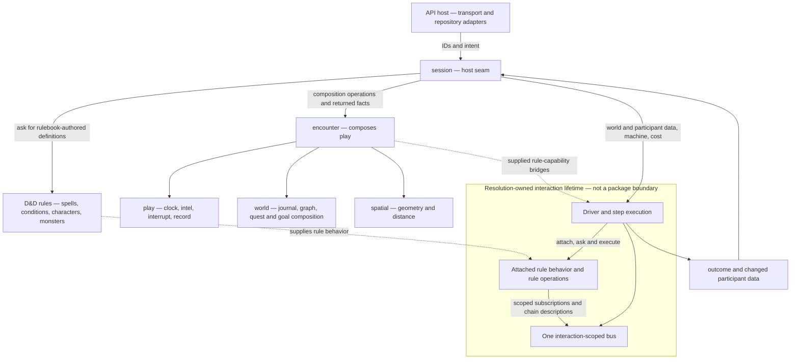
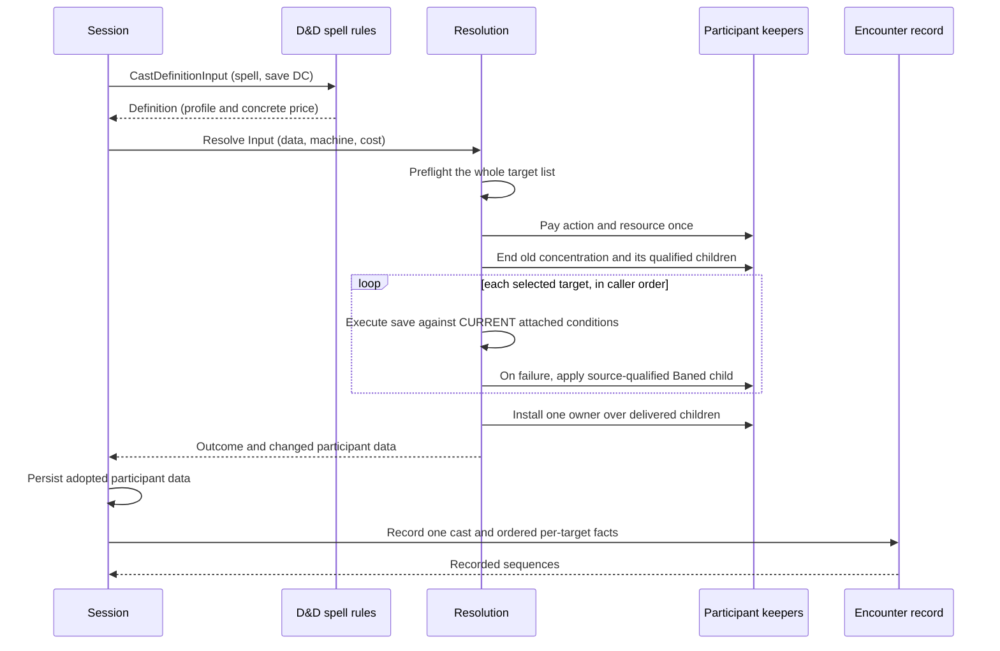
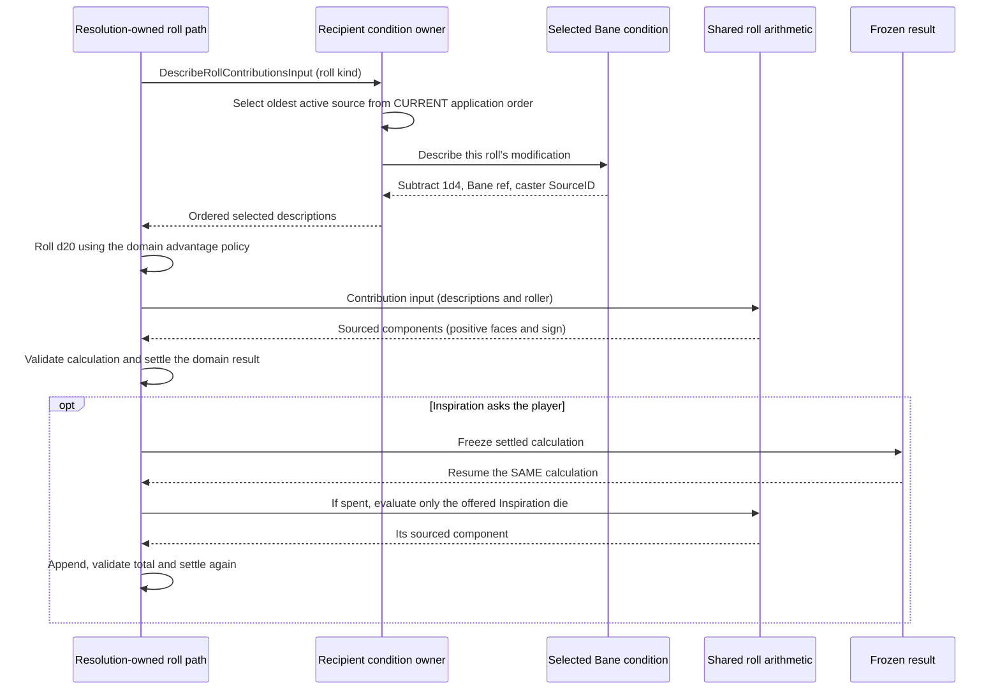
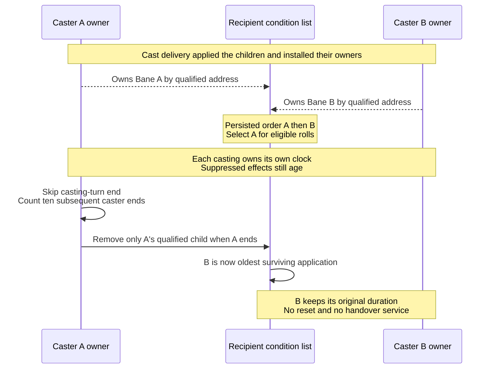

# Composable play — responsibilities and seams

**Purpose:** understand the layer a mechanic joins before reading its implementation.
Bane is the worked example, not the architecture's organizing principle.

This code-local overview sits beside the [rulebook README](README.md). Package godoc and tests remain
the authority for exact contracts; this document explains how those contracts compose without
copying their detailed laws.

**Evidence:** existing boundaries below were checked against toolkit `0aaa1807`.
**EXISTING** means a current responsibility, not that every legacy path has completed its transition.
**NEW/CHANGED** labels describe the approved Bane direction, not behavior shipped or tested by this
documentation change. Diagrams show responsibilities and operation sequences, **not a Go import
graph**.

## Why these layers exist

A host should express intent without implementing D&D. Small reusable packages should compose without
learning about one another or about spells. An interaction should run, return data, and end—without
leaving a bus, hidden decision, or suspended goroutine behind.

The composition coordinates play; resolution runs interactions; rulebook content supplies their
meaning. New mechanics extend the owner of their meaning rather than placing a convenient branch in
session or teaching a generic leaf about Bane.



The dashed bridge does not claim encounter imports resolution. Compositions ask through supplied
capabilities; session also directly raises interactions. Likewise, encounter uses the world pieces it
needs; not every encounter operation calls `World.Act`. Wiring is absorbed above the reusable pieces.

## Who owns what—and why

| Home | Owns | Why it belongs here | Must not absorb |
|---|---|---|---|
| **EXISTING `play/*` leaves** | Clock membership/advancement; observer intel; opaque interrupt windows; ordered records | Each is independently composable and returns values | D&D rules, RNG, buses, interpreting another leaf's payload |
| **EXISTING `world/*`** | Declared structure, audience-scoped facts, derived views and world composition | World facts are useful under different injected rulebooks | Bane, class resources, concentration ownership, direct dice decisions |
| **EXISTING `tools/spatial`** | Geometry and distance | Geometry is reusable; the rulebook supplies what range means | Spell eligibility, spell slots, concentration |
| **EXISTING `encounter`** | Coordinate clock/intel/record/world/spatial and supplied capabilities | These pieces need a composition to produce coherent play | Owning a bus, rolling a Bane die, interpreting frozen resolution payloads |
| **EXISTING `resolution`** | Attach participants, own the interaction bus, enforce preflight/payment order, drive steps and roll execution, return changed data/outcomes | One interaction needs one controlled execution lifetime | Class tables, hardcoded Bane selection, repositories, permanent services |
| **EXISTING/CHANGED D&D content and sheets** | Spell definitions, resource/condition state, ordered condition ownership, D&D applicability | These are the rules and facts whose meaning varies by game | Session orchestration, client presentation, a parallel global condition registry |
| **EXISTING `session`** | Load–act–save and compose host-facing operations from toolkit results | The host should not wire inner packages itself | Rolling dice, owning an interaction bus, deciding what Bane does |
| **EXISTING API/protos/UI boundary** | Translate contracts and present authoritative facts | Clients need intent and results, not duplicated rules | Choosing the contributing source, computing the result, telling toolkit which dice style to use |

`world` is not merely a map or a geometry package. Its composer injects a rule resolver and returns
facts. `play` leaves have no RNG or bus; those guarantees must not be casually generalized into a claim
that every package takes the same inputs or has the same lifecycle.

**Spell-slot state is CHANGED, not yet shipped.** The current character sheet still has a legacy
`SpellSlots` map alongside its recoverable `Resources`. The approved Bane work removes that parallel
mutable state without migration and makes a typed level-1 spell-slot resource the only runtime pool;
class spell-slot tables remain source progression data. Until that implementation lands, do not claim
that the new resource exists or extend the legacy map for another mechanic.

## The boundary around an interaction

**Bus custody is not the same as package location.** Resolution owns the bus lifetime. Attached rule
behavior may receive that bus capability inside the interaction; the host, encounter and play leaves
do not acquire it. A step machine does not receive it. A save helper may fold on resolution's supplied
bus without becoming another interaction driver.

For this new mechanic, a condition **describes** a modification or a follow-up. The operation's rolling
path evaluates it. That does not claim all historical condition handlers already obey this direction:
legacy rolling paths are not templates or permission for a second Bane execution path.

The current attachment contract is concrete: `core.Ref` identifies content with its `ID` field;
`ConditionBehavior.Ref()` returns that canonical identity; and `Apply(ctx, bus)` attaches behavior to
the bus resolution owns for the interaction.

| Status | Thing | Lifetime / authority |
|---|---|---|
| **EXISTING** | Compiled definition and price | Data describing this offered operation; does not spend itself |
| **EXISTING** | Character/monster condition list | Authoritative recipient state; ordered and serialized by its owner |
| **EXISTING** | Condition's persisted blob | Rule state and provenance, not a bus, roller, or live pointer |
| **EXISTING/CHANGED** | Attached condition behavior | Runtime behavior reconstructed for the interaction; new Bane behavior supplies a rule description |
| **NEW** | Selected dice contribution | Unresolved operation input; has source and notation, no face |
| **CHANGED** | Resolved calculation | Settled facts gain operator and source-entity details while preserving actual faces and checked total |
| **CHANGED** | Frozen operation | Settled state needed to resume gains the calculation facts; remains opaque to interrupt custody and session |

## Seam cards: read the inputs before the implementation

Prefer named inputs for new or changed operation boundaries. They expose meaning without adding unused
fields. Standard context/cancellation parameters are not a container for game state.

| Operation | Owner | Input → result | Side effects / important absence |
|---|---|---|---|
| **CHANGED Compile spell action** | `spells` | `CastDefinitionInput{Spell, SpellSaveDC}` → existing action definition or no supported content | No targets, bus, RNG, payment, or entire character object |
| **EXISTING Run interaction** | `resolution` | `Input{World, Participants, Machine, Cost, …}` → outcome and changed participant data | Owns attachment/teardown; does not persist repositories |
| **NEW Describe applicable contributions** | Recipient condition owner | `DescribeRollContributionsInput{Kind}` → selected descriptions | Reads current ordered state; does not roll or remove suppressed effects |
| **NEW Describe the selected effect** | Selected condition | Roll-kind input → the condition's sourced dice description | Bane knows `subtract 1d4`; collection does not manufacture that rule |
| **NEW Evaluate contributions** | Shared rulebook roll arithmetic, invoked by the operation | Selected descriptions and roller input → sourced resolved components | No condition list or stacking policy; exact helper signature still needs the input audit |
| **CHANGED Record result** | `encounter` | Ordered cast/result/calculation facts → recorded sequence facts | No new rolls, source selection or reconstruction from anonymous totals |

The compiler example becomes:

```go
spells.CastDefinition(spells.CastDefinitionInput{
    Spell:       spells.Bane,
    SpellSaveDC: 13,
})
```

`13` is a DC, not a spell level. Slot level, character level and spellcasting modifier are different
facts; add them only when a supported shape consumes them. A named input makes that extension explicit
without carrying a speculative character/context bag today.

## Worked sequence 1 — a cast joins the architecture

**Proposed Bane flow.** The diagram omits refusal branches for space: complete declaration validation
and ability to pay are checked before effects/RNG; a refused cast preserves the old concentration.



**Why each addition fits:** slot payment uses resources, not a new economy; fan-out composes existing
contests, not N host calls; concentration owns its children, not a world registry. World/play require
no Bane-specific branch. Current session cast persistence-before-record ordering is retained, not a
new claim of all-or-none repository transactions.

## Worked sequence 2 — a contribution joins a roll

**Proposed Bane roll flow.**



This diagram names semantic calls, not a second driver. The selected condition must connect to the
existing chain exactly once; the implementation must show where descriptions enter the chain rather
than quietly evaluating both a direct-description path and a subscription path.

**Freshness law:** use the live attached condition list in the order preserved by serialization, not a
stale repository snapshot. Do not select/cache contributors during whole-cast preflight. The old hold may be
removed after payment. Ask the recipient when its roll actually executes, after prior mutations in the
interaction. Then freeze the **resolved facts**, not a recipe that reselects or rerolls on resume.
A useful regression: recasting Bane removes the caster's old Bane before the target's new save; that
ended application must not still subtract a cached d4 from the save.

## Worked sequence 3 — state, ownership and time

**Proposed Bane ownership and timing flow.**



The address answers **which application belongs to whom**. D&D applicability answers **which one
contributes**. The selected condition answers **what it contributes**. Keeping those questions separate
allows a later Bless or another effect to fit without teaching the host about it.

## How a collaborator decides where new work belongs

Ask these before extending an interface:

1. **Meaning:** is this reusable clock/world/geometry behavior, or a D&D rule?
2. **Authority:** who already owns the state? Add no second mutable source or registry.
3. **Input:** which named facts does the operation need? Avoid an entire sheet when a few facts suffice.
4. **Time:** is the input read at declaration, execution, or resume? What may change between them?
5. **Effect:** who mutates, rolls or publishes—and why is that their responsibility?
6. **Result:** what does the next layer need without rediscovering the rule?
7. **Evidence:** which real-path test would fail if the responsibility moved to the wrong layer?

A missing capability needs a **named home and contract**, not a temporary implementation in session.
Conversely, one new mechanic does not justify a universal expression engine or a registry nobody needs.

## Review attention before implementation

- **Inputs:** the compiler's positional `13` is replaced in the plan with a named input. Complete the
  selected-condition and shared-evaluator Input/Output signatures with equally clear ownership before
  coding those seams; the cards describe their required facts, not an invented finished API.
- **Single route:** show precisely how selected condition descriptions enter the roll chain. No double
  contribution through direct calls plus attached subscribers.
- **Timing:** add the execution-time selection regression above alongside the existing freeze/resume
  tests. “Before RNG” alone does not distinguish preflight from actual execution.
- **Honesty:** keep EXISTING/NEW/CHANGED labels until real implementation and tests justify updating them.
  The overview is an aid to reviewing the seams, not evidence that the proposed code already exists.

## Code reading trail

Follow the owning package's contract and its real-path tests:

- [`play/README.md`](../../play/README.md) — composable leaves and their numbered laws.
- [`world/README.md`](../../world/README.md) and [`world/doc.go`](../../world/doc.go) — world composition and injected rule decisions.
- [`encounter/doc.go`](encounter/doc.go) — composition and supplied capabilities.
- [`resolution/doc.go`](resolution/doc.go) and [`resolution/cost_test.go`](resolution/cost_test.go) — bus lifetime, data boundary, steps and payment.
- [`session/doc.go`](session/doc.go) — the ID-and-repository host seam.
- [`../../core/ref.go`](../../core/ref.go) and [`events/events.go`](events/events.go) — canonical `Ref.ID` and the current `ConditionBehavior` contract.
- [`character/ledger_test.go`](character/ledger_test.go) — recoverable-resource payment and atomicity.
- [`conditions/concentrating_test.go`](conditions/concentrating_test.go) — current concentration ownership and timing behavior.

As **NEW/CHANGED** portions land, update their labels and bind the worked example to the production
tests that prove them. Do not copy role charters or turn this overview into a second policy store.
