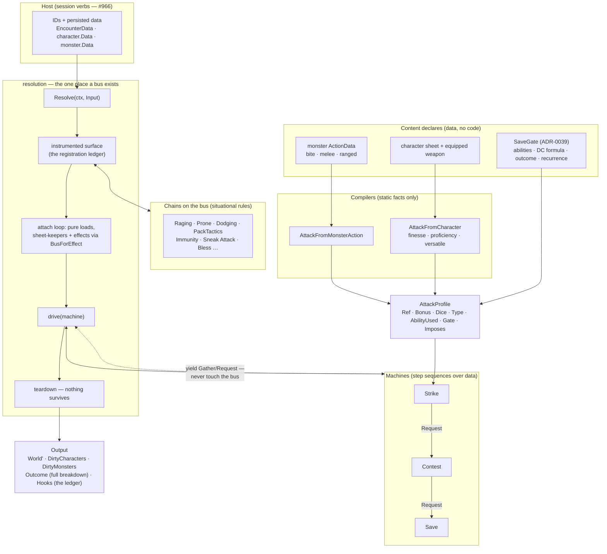
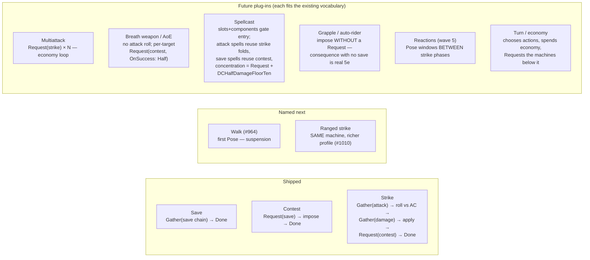

# How an Interaction Resolves: Machines, Compilers, and the One Bus

**Date:** 2026-08-15
**Status:** describes shipped architecture (resolution v0.6.0 era) plus the
named plug-in points. The per-module contracts live in each module's godoc;
this is the cross-cutting picture. Background: [ADR-0038] (resolution owns
the bus), [ADR-0039] (the save gate is data), and the
[attack profile seam](../../../docs/ideas/session-sdk/attack-profile-seam.md).

## The big picture

Everything at the seams is data. A host names IDs and hands over blobs; one
`Resolve` call later it gets blobs back. In between, exactly one event bus
exists, and it dies with the call.

The load-bearing properties, each pinned by tests rather than asserted:

- **R6, by construction**: a machine yields sealed steps and *cannot* reach
  the bus — `Gather`'s workings are unexported, and the strike machine does
  not even import the packages that could hand it one.
- **Attribution by construction**: the ledger records which effect made every
  subscription, because the loader that routed the ref stamps the surface
  before `Apply`. "This effect attached nothing" is an assertable fact.
- **Re-enterable by construction**: the machine's fields are the only state;
  every yield is a legal suspension point. `Pose` (the walk, reactions) will
  suspend without a redesign.

## Machines are step sequences; inputs are compiled content

A machine's identity is its **yield-shape** — the sequence of sealed steps it
runs — never the content driving it. That is the rule for when you need a new
one:

> **New machine when the step sequence differs. Same machine when only the
> data differs.**

Worked example of the rule: a **ranged strike** is the same
fold → roll → damage → rider sequence with different fold inputs (range
brackets, long-range disadvantage, prone's reversed interaction) — same
machine, richer `AttackProfile`. A **breath weapon** has no attack roll and
fans a save-for-half across targets — a different sequence, its own machine.
**Spellcasting** decomposes rather than being one giant machine: the entry
cost (slot, components) is economy; a fire bolt is strike-shaped; a
fireball is breath-weapon-shaped; hold person is contest-shaped with
`RecurrenceEndOfTurn`; concentration is a `Request` carrying
`DCHalfDamageFloorTen`. The vocabulary was built so spells *land* in it,
not beside it.

## Where a rule lives — the one table to check first

| A rule about… | Lives in | Example |
|---|---|---|
| static facts of content + sheet | **compiler** | finesse picks STR/DEX; proficiency; versatile dice |
| situational, per-swing judgment | **chain subscriber (effect)** | Rage's +2, Bless, prone's range split, immunity |
| the sequence of an interaction | **machine** | miss rolls no save; rider contests after damage |
| what can be declared at all | **content data + its types** | `SaveGate`, `KnockdownDC → gate`, damage dice |
| how many interactions you get | **economy (above machines)** | Extra Attack, Multiattack, action/bonus split |

Most "the profile needs a new field" arguments are chain contributions in
disguise; most "the machine needs a branch" arguments are economy. Check the
table before adding either.

## Every plug-in socket, and what it costs

| To add… | You write | Cost / gate |
|---|---|---|
| a monster (or weapon on one) | stat-block data | none — data only |
| a new attack source | a **compiler** → `AttackProfile` | additive; machine untouched |
| a new effect (condition/trait/feature) | `Apply` + chain handlers | additive; auto-attributed in the ledger |
| a new DC formula | a `DCSource` case | **must cite a RAW rule** (ADR-0039) |
| a new consequence kind | a `Consequence` constructor | sealed interface — resolution only |
| a new interaction | a **machine** over existing steps | cheap and safe — cannot touch the bus |
| a new **step kind** | vocabulary extension | **an ADR** (ADR-0038) — the only expensive door |

The gradient is deliberate: the closer to content, the cheaper; the closer to
the sealed vocabulary, the more it costs. Kirk's friend can ship a monster
with a gated bite without writing Go; a new step kind takes a design record.

## What is deliberately not in this picture yet

- **Reach/adjacency and ranged semantics** — #1010, lands with movement's
  neighborhood.
- **Auto-riders** (grapple-on-hit): `Imposes` without a `Gate` is currently
  *refused* as a bug shield — the machine would silently drop it. When
  grapple-style content arrives, that refusal becomes the direct-impose
  behavior. Scaffolding, not law.
- **The wire declaration of a rider** (`imposes:` in action data) — waits for
  the ghoul, the second gated condition, so the shape is designed against two
  examples rather than one.
- **`Pose`** — arrives with the walk; every machine above is already shaped
  for it.

[ADR-0038]: ../../../docs/adr/0038-resolution-owns-the-bus.md
[ADR-0039]: ../../../docs/adr/0039-the-save-gate.md
