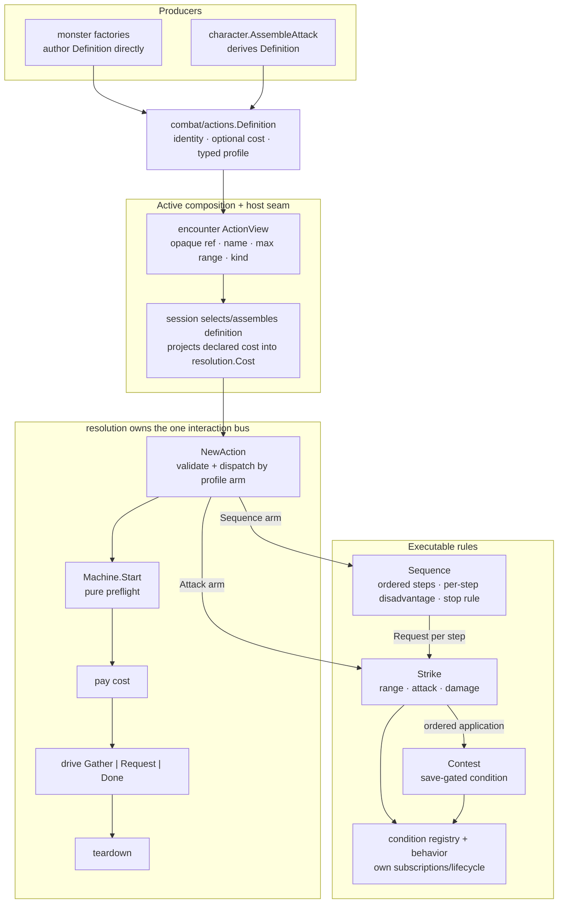

# How an Action Resolves: Shared Data, Machines, and the One Bus

**Status:** current architecture after rpg-toolkit#1198.

## Ownership

| Fact or behavior | Owner |
|---|---|
| action identity, name, declared price, typed profile | `combat/actions.Definition` |
| monster-authored numbers | `monster/monsters` factory literals |
| character equipment/ability derivation | `character.AssembleAttack` |
| opaque action projection for behavior | active `encounter.ActionView` |
| profile dispatch | `resolution.NewAction` |
| delivery/range, attack roll, ordered damage | Strike |
| step order, per-step modifiers, when a script stops | Sequence |
| save request | Contest / Save |
| executable effect and lifecycle | condition implementation |
| action economy policy | caller/session projects `Definition.Cost` into `Input.Cost`; resolution charges only that supplied runtime cost |

`NewAction` consumes the definition's typed profile but does not infer who pays
or which turn applies. The caller explicitly projects `Definition.Cost` into a
`resolution.Cost` carrying that runtime payer/turn context. A definition's cost
is therefore enforced at the resolution door without making profile dispatch
own action-economy policy.

Actions never activate themselves, subscribe, apply, remove, or manage a
lifecycle. There is no producer-specific compiler in resolution and no generic
monster-action implementation ref.

## Attack profile

`AttackProfile` covers any attack-roll interaction: melee/ranged weapon,
natural, unarmed, and melee/ranged spell attacks. Delivery is an exactly-one
melee/ranged union in feet. Optional ability and weapon fields are static
evidence; precomputed monster stat blocks may omit them honestly.

Damage is ADR-0041's ordered pool collection. A profile may omit damage only
when it declares at least one meaningful on-hit condition.

## Sequence profile

`SequenceProfile` is a script: ordered steps, each naming a component action
`core.Ref` the SAME actor carries plus whatever applies to that step alone.
The SRD's Multiattack is the whole of what it is for today.

`NewAction` resolves the steps against `ActionInput.Components` — the actor's
own definitions, supplied by whoever holds the actor, since this package loads
no sheets — through `actions.ResolveSequence`. A step naming something the
actor does not carry, or naming another sequence, is refused there, while
`Resolve` is still in pure preflight.

The machine owns three things and no rules: **order**, **per-step modifiers**,
and **the stop rule**. Every blow is the existing Strike, reached through
`Request` exactly as a cast reaches a contest per target, so reach, the attack
chain, criticals, damage, on-hit riders and Sanctuary are unchanged and
unduplicated.

A step's declared disadvantage travels as a `StrikeInput.Imposed` source —
`SourceRef` the sequence (the rule), `SourceID` the attacker (the die) — and
folds onto the component's attack chain **before** the fold, so an effect that
grants advantage cancels it exactly as it cancels the long-range source Strike
appends itself. Disadvantage is never a boolean; it reaches `rolls.RollD20` as
an imposed source and lands on the keep record under the reason the content
wrote.

Every step is preflighted before the first is run, because half a multiattack
cannot be taken back.

**The stop rule is about the target, not the blow.** A miss does not end a
sequence — "two attacks with its scimitar" is two swings whatever the first
one rolled. A downed target does, and `SequenceOutcome.Unswung` reports how
many declared steps never happened rather than leaving it to be reconstructed.

## Conditions

`ConditionApplication` contains a condition ref, opaque parameters, and an
optional `SaveGate`. Strike prepares registry behavior during pure Start, before
payment. On hit it processes applications in slice order:

- no save: publish the prepared condition and record `Applied:true`;
- save succeeds: record the Contest and `Applied:false`;
- save fails: publish the prepared condition and record `Applied:true`.

Multiple applications remain ordered data rather than an effects language.

## Extension rule

> Add a profile arm only when a distinct machine exists. Dispatch by profile
> type, never content identity.

Ranged attacks reuse Strike because their step sequence is unchanged. A
save-area attack or healing action earns a profile only with its own machine.
Multiattack earned one: the Sequence arm above dispatches to a machine that
owns order and a stop rule, and it dispatches on the populated profile without
ever learning the word.
